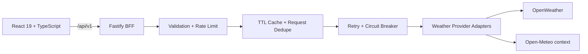

<div align="center">
  

# Hava81

**Türkiye'nin Meteorolojik Atlası**<br>
Decision-first weather intelligence for all 81 provinces of Türkiye.

[Live App](https://hava81.zekiakgul.dev/) · [API Docs](https://api.hava81.zekiakgul.dev/docs) · [Türkçe](README.tr.md)

[](https://github.com/zexy2/Hava81/actions/workflows/ci.yml)
[](https://api.hava81.zekiakgul.dev/api/v1/health/ready)
[](LICENSE)

</div>


## Why Hava81?

Most weather apps answer **what the weather is**. Hava81 is designed to answer **what it means for your day**.

It combines current conditions, hourly and daily forecasts, air quality and environmental signals with an explainable decision layer. Instead of presenting every metric with equal weight, Hava81 surfaces the next meaningful change, relevant risks and useful activity windows first.

- **Decision first** — “now or later?”, umbrella guidance and activity-specific recommendations.
- **Built for Türkiye** — all 81 provinces, local plate-code identity, Turkish-first product thinking and bilingual UI.
- **Explainable signals** — Hava81 Score and recommendations expose the weather factors behind the result.
- **Honest data UX** — provider, freshness, cache state, unavailable data and forecast limitations remain visible.
- **Accessible by design** — keyboard support, reduced motion, responsive layouts and light/dark/system themes.

## Product Highlights

| Area | What Hava81 provides |
| --- | --- |
| **Day Plan** | A 0–100 suitability score, next meaningful change and practical “now or later?” guidance |
| **Activities** | Context for walking, running, picnics, children, motorcycles and laundry |
| **Forecast** | Current weather, selectable hourly rhythm and five-day forecast |
| **Environment** | Air quality, UV, dust, pollen and supported coastal marine context |
| **Compare** | Decision-oriented comparison for up to three favorite cities |
| **Route weather** | Transparent inter-city weather-corridor estimates with a non-navigation disclaimer |
| **Personalization** | Favorites, recent cities, TR/EN, units, theme and persistent preferences |
| **Distribution** | Installable PWA, shareable summaries, city deep links, sitemap and optional browser alerts |

### Mobile

<p align="center">
  
</p>

## Live Surfaces

| Surface | URL |
| --- | --- |
| Web app | [hava81.zekiakgul.dev](https://hava81.zekiakgul.dev/) |
| API | [api.hava81.zekiakgul.dev/api/v1](https://api.hava81.zekiakgul.dev/api/v1/health/ready) |
| OpenAPI | [api.hava81.zekiakgul.dev/docs](https://api.hava81.zekiakgul.dev/docs) |

## Architecture

Hava81 keeps provider credentials and normalization logic out of the browser. The React application talks to a Fastify BFF, which validates requests, applies caching/resilience controls and talks to weather providers.



### Stack

| Layer | Technologies |
| --- | --- |
| Web | React 19, TypeScript, Vite |
| API | Fastify 5, Zod, OpenAPI |
| Mapping | Leaflet, React-Leaflet |
| Internationalization | i18next, react-i18next |
| Testing | Vitest, Testing Library, MSW, Playwright, Fastify inject |
| Quality | ESLint, TypeScript, Lighthouse CI |
| Delivery | Docker, GitHub Actions, GitHub Pages, Oracle Cloud |

## Getting Started

### Prerequisites

- Node.js 22+
- npm
- An [OpenWeather API key](https://openweathermap.org/api)

### 1. Clone and install

```bash
git clone https://github.com/zexy2/Hava81.git
cd Hava81
npm ci
npm ci --prefix apps/api
```

### 2. Configure the environment

```bash
cp .env.example .env
```

Set your server-only provider key in `.env`:

```env
OPENWEATHER_API_KEY=YOUR_OPENWEATHER_API_KEY
PORT=4000
VITE_API_BASE_URL=/api/v1
```

> [!IMPORTANT]
> `OPENWEATHER_API_KEY` must remain server-side. Never expose provider secrets through a `VITE_` variable or commit a populated `.env` file.

### 3. Run locally

Start the API:

```bash
npm run api:dev
```

In a second terminal, start the web app:

```bash
npm run dev
```

The web app runs on `http://localhost:5173`; the Fastify API runs on `http://localhost:4000` and exposes local OpenAPI documentation at `http://localhost:4000/docs`.

## Quality Gates

Before opening a pull request, the core checks can be run locally:

```bash
npm run type-check
npm run lint
npm test
npm run api:type-check
npm run api:test
npm run api:build
npm run build
npm run e2e
```

CI additionally validates browser flows across representative viewport sizes, Lighthouse budgets, Docker builds, deployment invariants and the production static shell.

## API Snapshot

| Endpoint | Purpose |
| --- | --- |
| `GET /api/v1/weather/current?city=İzmir` | Current conditions by city |
| `GET /api/v1/weather/current?lat=38.42&lon=27.13` | Current conditions by coordinates |
| `GET /api/v1/weather/forecast?lat=38.42&lon=27.13` | Forecast data |
| `GET /api/v1/weather/air-quality?lat=38.42&lon=27.13` | Air-quality snapshot |
| `GET /api/v1/weather/context?lat=38.42&lon=27.13` | UV, dust, pollen and optional marine context |
| `GET /api/v1/weather/route?...` | Approximate route-weather corridor |
| `GET /api/v1/health/live` | Liveness probe |
| `GET /api/v1/health/ready` | Readiness probe |

For the complete current contract, use the [interactive OpenAPI documentation](https://api.hava81.zekiakgul.dev/docs).

## Repository Guide

```text
apps/api/            Fastify BFF, provider adapters and API tests
src/                 React application, hooks, services and UI
public/              PWA, social and static assets
docs/                Product, quality and engineering documentation
deploy/              Production deployment support
scripts/             Build, verification and operational scripts
e2e/                 Playwright browser flows
```

### Documentation

| Document | Purpose |
| --- | --- |
| [PRODUCT.md](PRODUCT.md) | Product positioning, users and product principles |
| [DESIGN.md](DESIGN.md) | Visual language and design-system decisions |
| [Score model](docs/SCORE_MODEL.md) | Hava81 Score model and interpretation |
| [Quality baseline](docs/QUALITY_BASELINE.md) | Quality expectations and verification baseline |
| [Product roadmap](docs/PRODUCT_ROADMAP.md) | Product direction and planned work |
| [Contributing](CONTRIBUTING.md) | Development and pull-request workflow |
| [Security](SECURITY.md) | Responsible vulnerability reporting |
| [Support](SUPPORT.md) | Where to ask questions or report problems |

## Deployment

| Component | Production |
| --- | --- |
| Web | GitHub Pages at `hava81.zekiakgul.dev` |
| API | Oracle Cloud VPS at `api.hava81.zekiakgul.dev` |
| CI/CD | GitHub Actions |

The browser uses the public BFF URL in production. Provider credentials remain on the API host, and CORS limits browser access to approved web origins.

Docker is also supported:

```bash
cp .env.example .env
# Set OPENWEATHER_API_KEY, then:
docker compose up --build
```

## Contributing

Contributions are welcome. Please read [CONTRIBUTING.md](CONTRIBUTING.md) before opening a pull request. For security-sensitive reports, use the process in [SECURITY.md](SECURITY.md) instead of a public issue.

## License

Hava81 is released under the [MIT License](LICENSE).

## Data & Attribution

Weather data is provided through server-side provider adapters. Hava81 currently uses [OpenWeather](https://openweathermap.org/) for core weather data and [Open-Meteo](https://open-meteo.com/) for supported environmental context. Provider availability and limitations are intentionally surfaced in the product.
