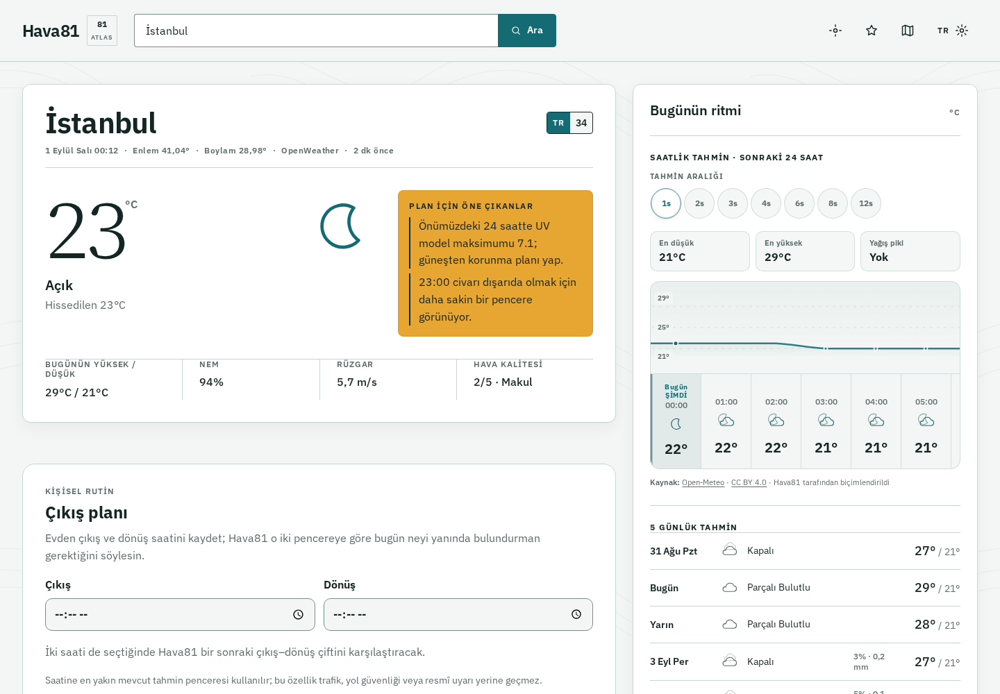
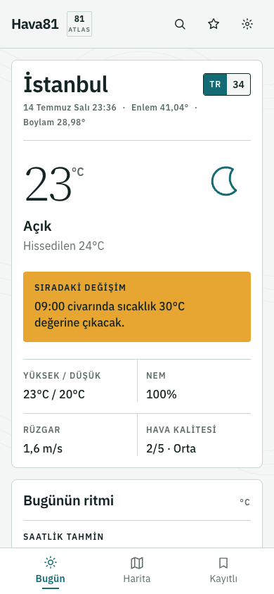

# Hava81 — Türkiye'nin Meteorolojik Atlası

Decision-first weather intelligence for all 81 Turkish provinces. Built with React 19 and a TypeScript Fastify BFF.

[](https://github.com/zexy2/Hava81/actions/workflows/ci.yml)
[](https://hava81.zekiakgul.dev/)
[](https://api.hava81.zekiakgul.dev/api/v1/health/ready)
[](LICENSE)

---

## Overview

Hava81 turns weather data into practical decisions for people in Türkiye. Its primary surface answers not only what the weather is doing, but when it is better to go outside, which activity windows are suitable, whether an umbrella is useful, and which risks materially change the day. Raw current conditions and three-hour forecasts remain visible, while a decision layer adds Hava81 Score, activity plans, air quality, real UV/dust/pollen context, optional marine context, city comparison and transparent route-weather estimates.

**Live Demo:** [hava81.zekiakgul.dev](https://hava81.zekiakgul.dev/) · **API:** [Oracle readiness endpoint](https://api.hava81.zekiakgul.dev/api/v1/health/ready)

---

## Product Preview

### Desktop meteorological atlas



### Mobile decision view

<p align="center">
  
</p>

---

## Features

### Core Functionality

- Real-time weather data for all 81 Turkish provinces
- Hava81 Day Plan with a 0–100 explainable suitability score and “now or later?” guidance
- Activity-specific planning for walking, running, picnics, children, motorcycles and laundry
- 5-day forecast with honest three-hour provider intervals
- Air-quality monitoring plus real UV, dust and pollen context from Open-Meteo
- Optional marine context for supported coastal locations, including wave height and sea-surface temperature
- Decision-oriented comparison for up to three favorite cities
- Transparent inter-city weather-corridor estimates with explicit non-navigation disclaimer
- Shareable decision summaries, installable PWA surface and opt-in browser decision alerts
- 81 generated city entry pages, canonical URLs and sitemap for reliable deep links and SEO
- Visible provider, cache, freshness and attribution metadata

### User Interface

- Original atlas-inspired visual system with topographic texture and local plate codes
- Responsive editorial layout with dedicated mobile bottom navigation
- Deterministic inline SVG weather symbols instead of emoji or remote icon assets
- Accessible light, dark and automatic themes
- Restrained CSS animation with explicit reduced-motion handling
- Full keyboard navigation support
- Responsive layout for mobile, tablet, and desktop

### Map Integration

- Interactive Turkey map powered by Leaflet.js
- Click-to-navigate city markers
- Temperature-based color coding

### Settings

- Language support: Turkish and English (i18next)
- Temperature units: Celsius / Fahrenheit
- Wind speed units: m/s, km/h, mph
- Persistent preferences via localStorage

---

## Tech Stack

| Category   | Technologies                                                  |
| ---------- | ------------------------------------------------------------- |
| Framework  | React 19.1, TypeScript 6                                      |
| Styling    | CSS, semantic design tokens, responsive atlas layout          |
| Typography | IBM Plex Sans Variable, Source Serif 4 Variable               |
| Animation  | CSS keyframes/transitions with reduced-motion handling        |
| Maps       | Leaflet.js, React-Leaflet                                     |
| i18n       | react-i18next                                                 |
| HTTP       | Custom httpClient with caching and retry logic                |
| Backend    | Fastify 5, Zod, OpenAPI                                       |
| Security   | Helmet, CORS, server-side provider credentials, rate limiting |
| Testing    | Vitest, Testing Library, MSW, Playwright, Fastify inject      |
| Build      | Vite 8, Lighthouse CI, Docker                                 |

---

## Architecture

```
src/
├── api/                    # HTTP client, weather service, error handling
├── components/hava81/      # Decision field, forecast atlas, environment rail
├── components/             # Search, map, settings and supporting UI
├── context/                # React Context for global state (SettingsContext)
├── hooks/                  # Custom hooks (useWeather, useForecast, useDebounce)
├── i18n/                   # Internationalization config and locale files
├── constants/              # Static data (city list)
├── types/                  # TypeScript type definitions
├── utils/                  # Weather helpers and transport normalization
└── styles/                 # Global CSS

apps/api/
├── src/providers/          # OpenWeather adapter and runtime response schemas
├── src/modules/weather/    # Versioned routes and normalized weather service
├── src/core/               # TTL cache, dedupe, resilience/circuit breaker and errors
└── test/                   # Fastify inject integration tests
```

### Data Flow

```
React Components -> hooks -> frontend weatherService
                               |
                               v
                    Fastify API (/api/v1)
                    | validation, rate limit
                    | TTL cache + request dedupe
                    | retries + circuit breaker
                               |
                               v
                    OpenWeather provider adapter
                    | optional compatible fallback endpoint
```

---

## Getting Started

### Prerequisites

- Node.js 22 or higher
- npm or yarn
- OpenWeather API key ([Get one here](https://openweathermap.org/api))

### Installation

```bash
# Clone the repository
git clone https://github.com/zexy2/Hava81.git
cd Hava81

# Install dependencies
npm ci
npm ci --prefix apps/api

# Configure environment
cp .env.example .env
# Add the server-only OpenWeather key to .env

# Terminal 1: start the API on port 4000
npm run api:dev

# Terminal 2: start the Vite web app on port 5173
npm run dev
```

### Environment Variables

```
OPENWEATHER_API_KEY=your_server_only_api_key
VITE_API_BASE_URL=/api/v1
```

`OPENWEATHER_API_KEY` is read only by `apps/api`; it must never use a `VITE_` prefix.
Only values prefixed with `VITE_` are browser-visible. The relative web URL is forwarded
to port 4000 by the Vite development proxy and to the API container by Nginx in production.

### API

| Endpoint                                              | Description                        |
| ----------------------------------------------------- | ---------------------------------- |
| `GET /api/v1/weather/current?city=İzmir`              | Current conditions by city         |
| `GET /api/v1/weather/current?lat=38.42&lon=27.13`     | Current conditions by coordinates  |
| `GET /api/v1/weather/forecast?lat=38.42&lon=27.13`    | Three-hour and five-day forecast   |
| `GET /api/v1/weather/air-quality?lat=38.42&lon=27.13` | Air-quality snapshot               |
| `GET /api/v1/weather/context?lat=38.42&lon=27.13`     | UV, dust, pollen, optional marine  |
| `GET /api/v1/weather/route?...`                       | Approximate route-weather corridor |
| `GET /api/v1/health/live`                             | Liveness probe                     |
| `GET /api/v1/health/ready`                            | Readiness probe                    |

Interactive OpenAPI documentation is available at `http://localhost:4000/docs`.

---

## Available Scripts

| Command                  | Description                        |
| ------------------------ | ---------------------------------- |
| `npm run dev`            | Run Vite development server        |
| `npm run build`          | Create production build            |
| `npm test`               | Run test suite                     |
| `npm run test:coverage`  | Generate coverage report           |
| `npm run lint`           | Run ESLint                         |
| `npm run lint:fix`       | Auto-fix linting issues            |
| `npm run type-check`     | TypeScript type checking           |
| `npm run api:dev`        | Run the Fastify API on port 4000   |
| `npm run api:test`       | Run API inject tests               |
| `npm run api:type-check` | Type-check the API                 |
| `npm run api:build`      | Build the production API bundle    |
| `npm run e2e`            | Run Playwright browser flows       |
| `npm run lighthouse`     | Run Lighthouse performance/a11y CI |

---

## Quality Gates

The CI pipeline runs type checking, zero-error ESLint, Vitest coverage, API tests/build,
Playwright flows at 390/768/1280 px, Lighthouse budgets, and the production build.
Provider secrets stay server-side; frontend production dependencies and API dependencies
are audited separately.

---

## Keyboard Shortcuts

| Shortcut               | Action        |
| ---------------------- | ------------- |
| `Ctrl/Cmd + K`         | Open search   |
| `Ctrl/Cmd + ,`         | Open settings |
| `Escape`               | Close modal   |
| `Ctrl/Cmd + Shift + R` | Refresh data  |

---

## Production Deployment

| Surface          | Platform         | Production address                                                                      |
| ---------------- | ---------------- | --------------------------------------------------------------------------------------- |
| React web app    | GitHub Pages     | [hava81.zekiakgul.dev](https://hava81.zekiakgul.dev/)                                   |
| Fastify BFF      | Oracle Cloud VPS | [api.hava81.zekiakgul.dev/api/v1](https://api.hava81.zekiakgul.dev/api/v1/health/ready) |
| Weather provider | OpenWeather      | Accessed only by the server-side provider adapter                                       |
| CI/CD            | GitHub Actions   | Frontend, API, tests, Docker image and Pages deployment                                 |

```text
GitHub Pages browser
        │ public API base URL
        ▼
Oracle Cloud Fastify BFF
        │ server-only provider credential
        ▼
OpenWeather
```

The browser bundle uses `https://api.hava81.zekiakgul.dev/api/v1` as its public
API base URL. `OPENWEATHER_API_KEY` remains a server-only Oracle environment
secret, while `CORS_ORIGINS=https://hava81.zekiakgul.dev,https://zexy2.github.io` limits
browser access to the deployed web origin.

Production probes:

- [`GET /api/v1/health/live`](https://api.hava81.zekiakgul.dev/api/v1/health/live)
- [`GET /api/v1/health/ready`](https://api.hava81.zekiakgul.dev/api/v1/health/ready)
- [Interactive OpenAPI documentation](https://api.hava81.zekiakgul.dev/docs)

> The API runs on the Oracle VPS, so it does not depend on Render Free tier
> cold starts.

---

## Docker

```bash
# Production web + API
cp .env.example .env
# Set OPENWEATHER_API_KEY in .env, then:
docker compose up --build

# Development
npm run docker:dev
```

Static hosts such as GitHub Pages must set `VITE_API_BASE_URL` to the
absolute URL of a separately deployed API. The build also emits `404.html` as an SPA
fallback so direct city URLs such as `/ankara` remain shareable. The provider key remains only in the
API deployment environment.

---

## Project Structure Decisions

**Why custom httpClient instead of axios?**

- Smaller bundle size
- Built-in caching layer
- Custom retry logic with exponential backoff
- Type-safe error handling

**Why CSS instead of CSS-in-JS?**

- Better performance (no runtime overhead)
- Native CSS variables for theming
- Smaller bundle size

**Why Context API instead of Redux?**

- Simpler mental model for this scale
- No boilerplate
- Built into React

---

## Contributing

1. Fork the repository
2. Create a feature branch (`git checkout -b feature/new-feature`)
3. Commit changes (`git commit -m 'Add new feature'`)
4. Push to branch (`git push origin feature/new-feature`)
5. Open a Pull Request

---

## License

MIT License - see [LICENSE](LICENSE) for details.

---

## Acknowledgments

- [OpenWeather](https://openweathermap.org/) for the weather API
- [Leaflet](https://leafletjs.com/) for the mapping library
- Browser-native CSS animation primitives for lightweight motion
