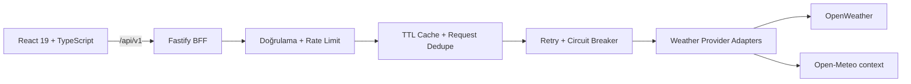

<div align="center">
  

# Hava81

**Türkiye'nin Meteorolojik Atlası**<br>
Türkiye'nin 81 ili için karar odaklı hava durumu deneyimi.

[Canlı Uygulama](https://hava81.zekiakgul.dev/) · [API Dokümantasyonu](https://api.hava81.zekiakgul.dev/docs) · [English](README.md)

[](https://github.com/zexy2/Hava81/actions/workflows/ci.yml)
[](https://api.hava81.zekiakgul.dev/api/v1/health/ready)
[](LICENSE)

</div>


## Neden Hava81?

Çoğu hava durumu uygulaması **havanın ne olduğunu** söyler. Hava81, **havanın günün için ne anlama geldiğini** anlatmak üzere tasarlanır.

Anlık koşulları, saatlik ve günlük tahmini, hava kalitesini ve çevresel sinyalleri açıklanabilir bir karar katmanıyla birleştirir. Tüm meteorolojik değerleri aynı önemde göstermek yerine sıradaki anlamlı değişimi, ilgili riskleri ve uygun aktivite zamanlarını öne çıkarır.

- **Karar önce gelir** — “şimdi mi sonra mı?”, şemsiye ihtiyacı ve aktiviteye özel yönlendirmeler.
- **Türkiye için tasarlandı** — 81 il, plaka kodu kimliği, yerel ürün yaklaşımı ve Türkçe/İngilizce arayüz.
- **Açıklanabilir sinyaller** — Hava81 Skoru ve önerilerin hangi hava koşullarından etkilendiği görünürdür.
- **Dürüst veri deneyimi** — sağlayıcı, güncellik, cache durumu, eksik veri ve tahmin sınırları saklanmaz.
- **Erişilebilirlik odaklı** — klavye kullanımı, reduced-motion desteği, responsive tasarım ve açık/koyu/sistem temaları.

## Ürün Özeti

| Alan | Hava81 ne sunuyor? |
| --- | --- |
| **Gün Planı** | 0–100 uygunluk skoru, sıradaki anlamlı değişim ve “şimdi mi sonra mı?” yönlendirmesi |
| **Aktiviteler** | Yürüyüş, koşu, piknik, çocuklar, motosiklet ve çamaşır için bağlamsal değerlendirme |
| **Tahmin** | Anlık hava, seçilebilir saatlik ritim ve beş günlük tahmin |
| **Çevre** | Hava kalitesi, UV, toz, polen ve desteklenen kıyı noktalarında deniz bağlamı |
| **Karşılaştırma** | En fazla üç favori şehri karar odaklı karşılaştırma |
| **Rota havası** | Navigasyon olmadığını açıkça belirten şehirler arası hava koridoru tahmini |
| **Kişiselleştirme** | Favoriler, son şehirler, TR/EN, birimler, tema ve kalıcı tercihler |
| **Dağıtım** | Kurulabilir PWA, paylaşılabilir özetler, şehir deep-link'leri, sitemap ve isteğe bağlı tarayıcı uyarıları |

### Mobil

<p align="center">
  
</p>

## Canlı Yüzeyler

| Yüzey | Adres |
| --- | --- |
| Web uygulaması | [hava81.zekiakgul.dev](https://hava81.zekiakgul.dev/) |
| API | [api.hava81.zekiakgul.dev/api/v1](https://api.hava81.zekiakgul.dev/api/v1/health/ready) |
| OpenAPI | [api.hava81.zekiakgul.dev/docs](https://api.hava81.zekiakgul.dev/docs) |

## Mimari

Hava81 sağlayıcı anahtarlarını ve veri normalizasyonunu tarayıcıdan uzak tutar. React uygulaması Fastify BFF ile konuşur; BFF istekleri doğrular, cache/resilience kontrollerini uygular ve hava durumu sağlayıcılarına erişir.



### Teknoloji Yığını

| Katman | Teknolojiler |
| --- | --- |
| Web | React 19, TypeScript, Vite |
| API | Fastify 5, Zod, OpenAPI |
| Harita | Leaflet, React-Leaflet |
| Dil | i18next, react-i18next |
| Test | Vitest, Testing Library, MSW, Playwright, Fastify inject |
| Kalite | ESLint, TypeScript, Lighthouse CI |
| Dağıtım | Docker, GitHub Actions, GitHub Pages, Oracle Cloud |

## Yerelde Çalıştırma

### Gereksinimler

- Node.js 22+
- npm
- Bir [OpenWeather API anahtarı](https://openweathermap.org/api)

### 1. Repoyu klonla ve bağımlılıkları yükle

```bash
git clone https://github.com/zexy2/Hava81.git
cd Hava81
npm ci
npm ci --prefix apps/api
```

### 2. Ortam değişkenlerini hazırla

```bash
cp .env.example .env
```

Sunucu tarafında kalması gereken sağlayıcı anahtarını `.env` içine ekle:

```env
OPENWEATHER_API_KEY=YOUR_OPENWEATHER_API_KEY
PORT=4000
VITE_API_BASE_URL=/api/v1
```

> [!IMPORTANT]
> `OPENWEATHER_API_KEY` yalnızca sunucuda kalmalıdır. Sağlayıcı anahtarlarını `VITE_` değişkeniyle tarayıcıya açma ve doldurulmuş `.env` dosyasını commit etme.

### 3. Uygulamayı başlat

API:

```bash
npm run api:dev
```

İkinci terminalde web uygulaması:

```bash
npm run dev
```

Web uygulaması `http://localhost:5173`, Fastify API `http://localhost:4000` üzerinde çalışır. Yerel OpenAPI dokümantasyonu `http://localhost:4000/docs` adresindedir.

## Kalite Kapıları

Pull request açmadan önce temel kontroller yerelde çalıştırılabilir:

```bash
npm run type-check
npm run lint
npm test
npm run api:type-check
npm run api:test
npm run api:build
npm run build
npm run e2e
```

CI ayrıca farklı ekran boyutlarında browser akışlarını, Lighthouse bütçelerini, Docker build'ini, deployment invariants kontrollerini ve production statik yüzeyini doğrular.

## API Özeti

| Endpoint | Amaç |
| --- | --- |
| `GET /api/v1/weather/current?city=İzmir` | Şehre göre anlık koşullar |
| `GET /api/v1/weather/current?lat=38.42&lon=27.13` | Koordinata göre anlık koşullar |
| `GET /api/v1/weather/forecast?lat=38.42&lon=27.13` | Tahmin verisi |
| `GET /api/v1/weather/air-quality?lat=38.42&lon=27.13` | Hava kalitesi |
| `GET /api/v1/weather/context?lat=38.42&lon=27.13` | UV, toz, polen ve uygun yerde deniz bağlamı |
| `GET /api/v1/weather/route?...` | Yaklaşık rota-hava koridoru |
| `GET /api/v1/health/live` | Liveness kontrolü |
| `GET /api/v1/health/ready` | Readiness kontrolü |

Güncel API sözleşmesinin tamamı için [etkileşimli OpenAPI dokümantasyonunu](https://api.hava81.zekiakgul.dev/docs) kullan.

## Repo Rehberi

```text
apps/api/            Fastify BFF, sağlayıcı adaptörleri ve API testleri
src/                 React uygulaması, hook'lar, servisler ve UI
public/              PWA, sosyal ve statik varlıklar
docs/                Ürün, kalite ve mühendislik dokümantasyonu
deploy/              Production deployment desteği
scripts/             Build, doğrulama ve operasyon scriptleri
e2e/                 Playwright browser akışları
```

### Dokümantasyon

| Belge | Amaç |
| --- | --- |
| [PRODUCT.md](PRODUCT.md) | Ürün konumlandırması, kullanıcılar ve ürün ilkeleri |
| [DESIGN.md](DESIGN.md) | Görsel dil ve tasarım sistemi kararları |
| [Skor modeli](docs/SCORE_MODEL.md) | Hava81 Skoru modeli ve yorumlanması |
| [Kalite baseline](docs/QUALITY_BASELINE.md) | Kalite hedefleri ve doğrulama tabanı |
| [Ürün yol haritası](docs/PRODUCT_ROADMAP.md) | Ürün yönü ve planlanan çalışmalar |
| [Katkı rehberi](CONTRIBUTING.md) | Geliştirme ve pull-request akışı |
| [Güvenlik](SECURITY.md) | Güvenlik açığı bildirim süreci |
| [Destek](SUPPORT.md) | Soru ve sorunlar için doğru kanal |

## Production

| Bileşen | Production |
| --- | --- |
| Web | GitHub Pages — `hava81.zekiakgul.dev` |
| API | Oracle Cloud VPS — `api.hava81.zekiakgul.dev` |
| CI/CD | GitHub Actions |

Tarayıcı production ortamında public BFF adresini kullanır. Sağlayıcı anahtarları API sunucusunda kalır; CORS yalnızca onaylı web origin'lerine izin verir.

Docker da desteklenir:

```bash
cp .env.example .env
# OPENWEATHER_API_KEY değerini gir, ardından:
docker compose up --build
```

## Katkıda Bulunma

Katkılar memnuniyetle karşılanır. Pull request açmadan önce [CONTRIBUTING.md](CONTRIBUTING.md) dosyasını oku. Güvenlik açısından hassas bildirimlerde public issue yerine [SECURITY.md](SECURITY.md) sürecini kullan.

## Lisans

Hava81 [MIT Lisansı](LICENSE) ile yayınlanır.

## Veri ve Atıf

Hava durumu verileri sunucu tarafındaki sağlayıcı adaptörleri üzerinden alınır. Hava81 temel hava durumu için [OpenWeather](https://openweathermap.org/), desteklenen çevresel bağlam için [Open-Meteo](https://open-meteo.com/) kullanır. Sağlayıcı erişilebilirliği ve veri sınırları ürün içinde açıkça gösterilir.
