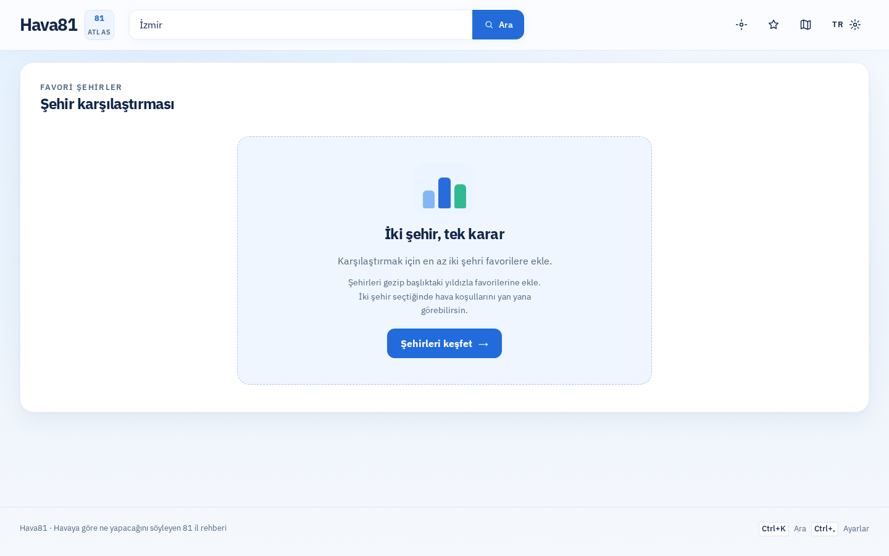
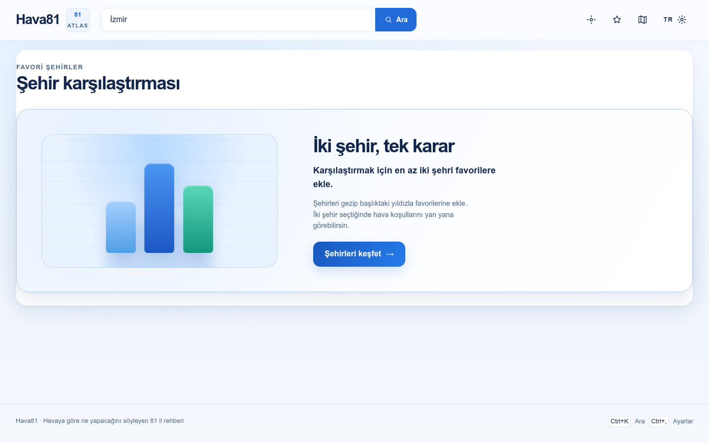
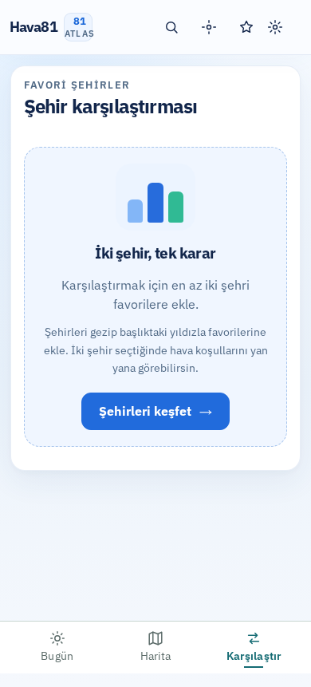
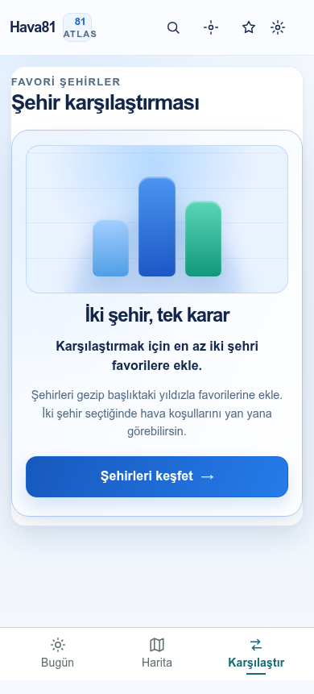
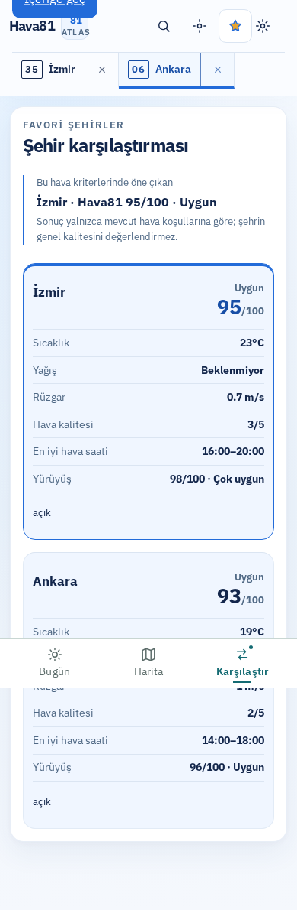
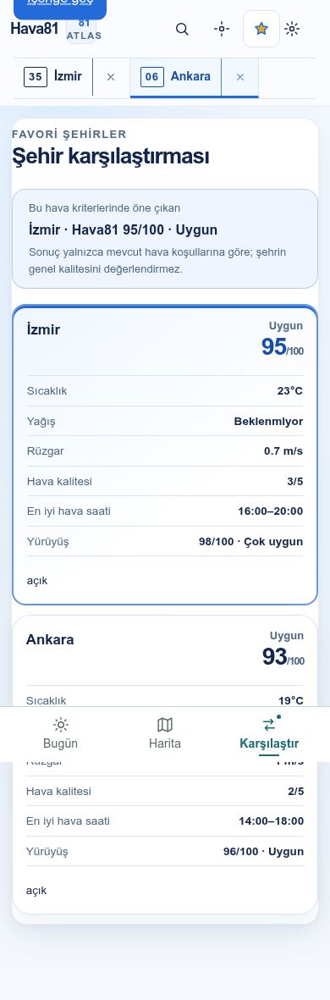
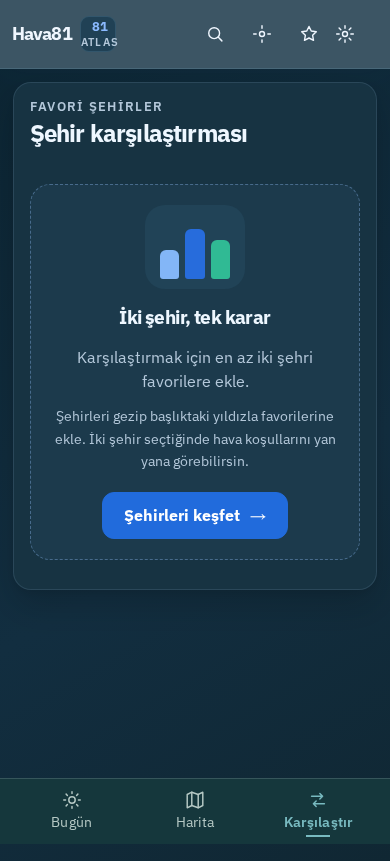
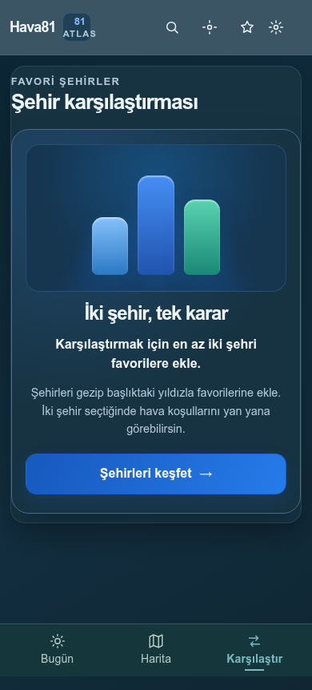

# Hava81 — Visual Audit & Comparison Redesign (2026-10-09)

## Scope
- Live site baseline: https://hava81.zekiakgul.dev/izmir/ on 2026-10-09.
- After screenshots: isolated Vite preview of `feat/all-screen-visual-audit-20261009`, not the deployed website.
- Playwright states: today dashboard, search, settings, map, empty comparison, **real two-favorite comparison (İzmir + Ankara)**.
- Viewports: desktop 1440 px; mobile 390 px (light/dark); narrow mobile 320 px.

## Visual changes (before → after)
1. **Empty comparison layout:** small centered diagram inside a dashed box → wide editorial comparison surface with a two-column composition on desktop and stacked mobile layout.
2. **Visual hierarchy:** generic small bars → tall three-column chart illustration, soft chart grid, depth and atmospheric gradient.
3. **Content:** cramped headline and instructions → larger semantic heading and readable copy; full-width high-contrast primary CTA on mobile.
4. **Populated comparisons:** adjacent unseparated metric columns → distinct rounded city cards with clear winner outline, spacing and score emphasis.
5. **Winner summary:** minimal vertical line → prominent tinted status card with border.
6. **Responsive:** CSS at <= 767 px, including 320 px phones; dark theme uses its own backgrounds, with the same text content and controls.

## Playwright screenshots (stored alongside this report)
| State | Before (live) | After (local preview) |
|---|---|---|
| Desktop empty |  |  |
| Mobile empty |  |  |
| Mobile with İzmir + Ankara |  |  |
| Dark mobile empty |  |  |

### Additional local-only evidence
Complete screenshots including desktop with both cities, tablet/responsive dashboard, map, settings, and mobile search are kept on the remote server:
`/home/ubuntu/Hava81-all-screens-20261009/test-results/all-screens/{before,after}/`.
Regenerate them with `node scripts/capture-all-screen-states.mjs` (requires Playwright browsers; local preview requires API access). The baseline and local preview must not be confused.

## Verification
- TypeScript `npm run type-check`: PASS.
- ESLint `npm run lint`: PASS.
- Vitest `npm test -- --reporter=dot`: **763/763 passing (108 files)**.
- Production build `npm run build`: PASS, 81 generated city pages.
- Playwright: all 320 px states, including a two-city comparison, captured on retry; other listed viewports captured.
- 320/390/1440 px capture reports show `document.documentElement.scrollWidth === innerWidth` for the recorded cases (no horizontal page overflow).
- CI/CodeQL: pending GitHub PR checks. **Do not merge/deploy until green.**

## Isolation / precautions
No changes made to `/home/ubuntu/Hava81-latest` or its uncommitted files. The other in-progress visual-overhaul worktree is untouched. Styling is limited to `ComparePanel.css` to minimize conflicts.
