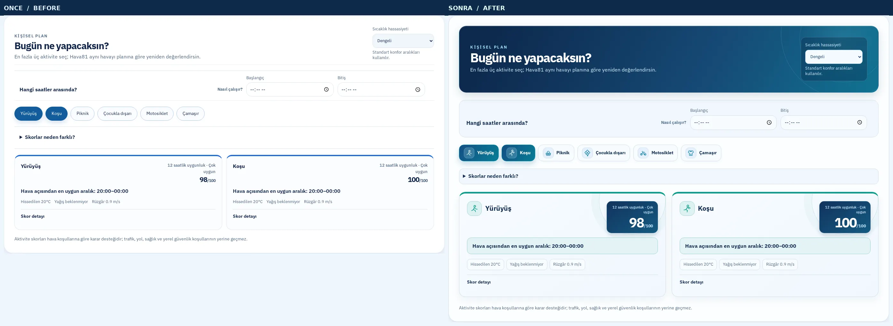
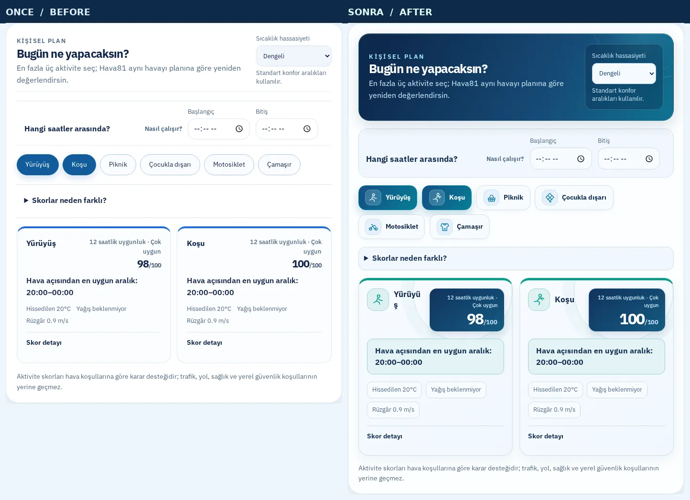
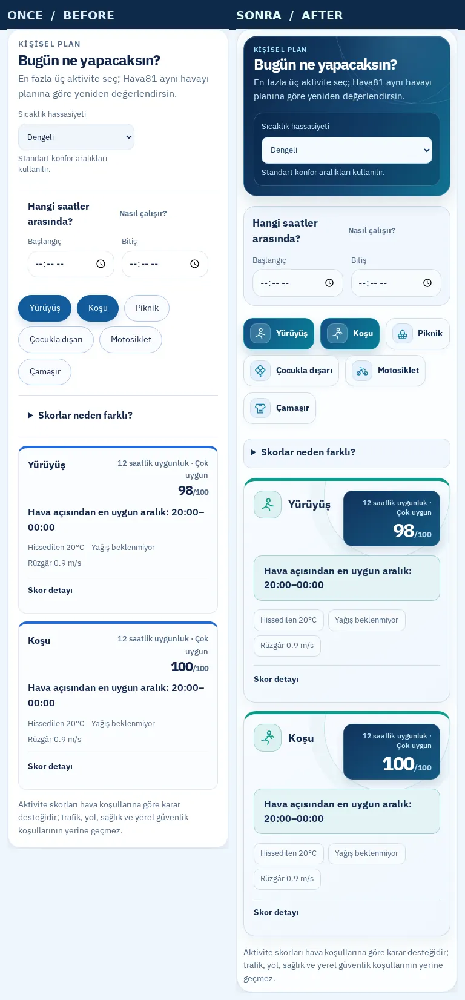
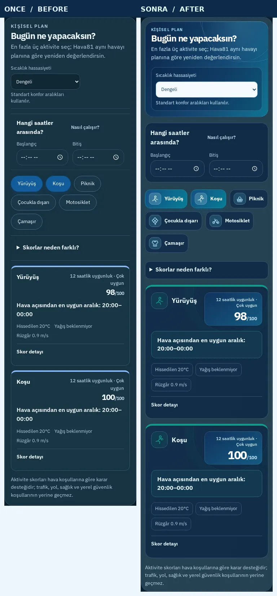
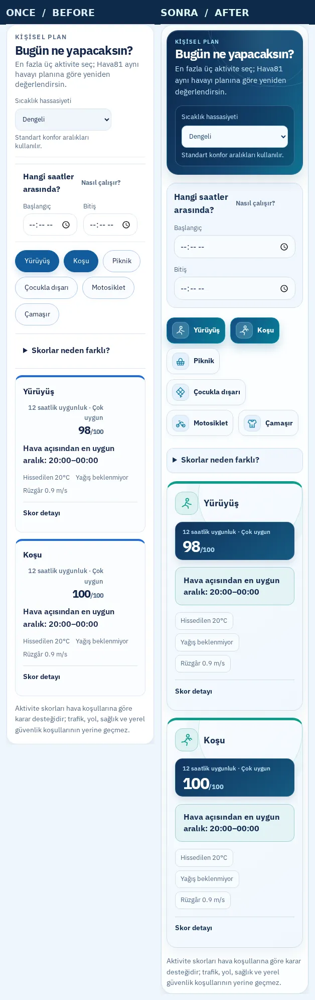
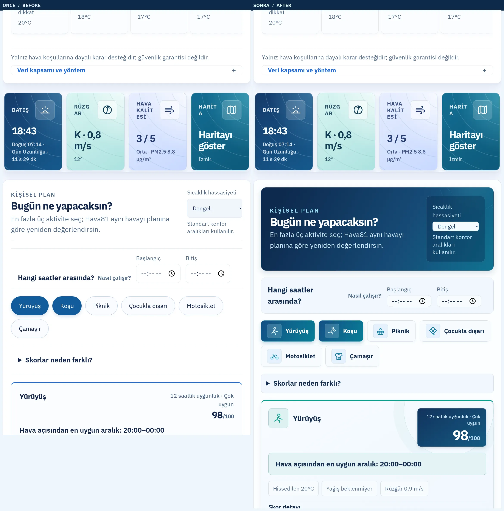
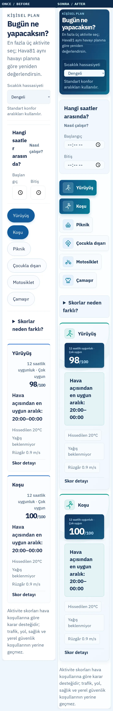

# Hava81 — Aktivite Planlayıcı / Premium Editorial Studio

**Tarih:** 9 Ekim 2026

**Geliştirme dalı:** `feat/activity-planner-editorial-20261009`

**Temel sürüm:** `main`, 5 günlük premium tahmin takvimi PR #1296 sonrası.

## Önce → Sonra: Yapılan görsel geliştirmeler

1. Düz beyaz başlık → lacivert–turkuaz atmosfer gradyanı, büyük tipografi ve gökyüzü konturları.
2. Sıcaklık hassasiyeti → yarı saydam, yüksek kontrastlı ayrı başlık kontrol alanı.
3. Zaman seçimi → yuvarlatılmış planlama paneli, daha güçlü başlık ve okunur alanlar.
4. Altı aktivite → erişilebilir metin etiketlerine eşlik eden özel SVG ikonlar.
5. Seçim butonları → aktif durumlarda turkuaz gradyan, belirgin görsel vurgular.
6. Aktivite puanı → büyük koyu mavi blok, yüksek kontrastlı /100 değeri ve uygunluk özeti.
7. En uygun zaman → ayrı renkli sonuç yüzeyi; hava koşulları → okunabilir küçük kapsüller.
8. Farklı skor seviyeleri → uygunluk türüne göre yeşil, mavi, amber ve kırmızı vurgu.
9. Koyu tema için ayrı bütünlüklü renk paleti; 320px için kompakt yerleşim.
10. %200 metin büyütmede otomatik tek sütunlu kart başlığı ve puan; taşan dekoratif konturlar giderildi.
11. Reduced-motion, forced-colors, klavye odağı ve minimum dokunma alanları korundu.
12. Hava verisi, puanlama, aktivite filtresi, tercihler ve saat hesabı hiç değiştirilmedi.

## Gerçek Playwright görsel arşivi

Sol **ÖNCE**: Hava81 canlı site; sağ **SONRA**: yeni sürümün izole Vite production-preview'u. Her ikisi gerçek Chromium ile aynı ekran genişliğinde, iki aktivite seçili ve skorları dolu durumdayken görüntülendi.

| Ekran | Gerçek yan yana karşılaştırma |
|---|---|
| 1440 px masaüstü · açık |  |
| 768 px tablet · açık |  |
| 390 px mobil · açık |  |
| 390 px mobil · koyu |  |
| 320 px telefon · açık |  |
| 1280 px masaüstü · %200 metin |  |
| 390 px mobil · %200 metin |  |

## Doğrulama ve koruma kuralları

- TypeScript ✅, ESLint ✅, Vite production build / 81 şehir SEO sayfası ✅.
- Vitest: **763/763**, 108 test dosyası ✅.
- %200 metin büyütme Playwright regresyon testi ✅; dekoratif yüzeyden kaynaklı kart içi taşma giderildi.
- Playwright gerçek görsel taraması: **14/14**, yatay sayfa taşması ve JS pageerror yok ✅.
- Testler güncel skorun içeriğini silmeden yeni görsel kimliği ve SVG ikonları da kontrol ediyor.
- Çekim komutu: `node scripts/capture-activity-editorial.mjs`. Başlangıç/bitiş adresleri ve çıktı klasörü `HAVA81_ACTIVITY_BEFORE_URL`, `HAVA81_ACTIVITY_AFTER_URL`, `HAVA81_ACTIVITY_OUTPUT` ile değiştirilebilir.
- Ham görüntüler ve `report.json` ayrı geliştirme worktree'sindeki `.visual-captures-activity-final/` klasöründe saklanır (GitHub'a yalnızca seçilmiş yan yana görseller girer).
- Ana çalışma dizinindeki **üç commit edilmemiş dosyaya dokunulmadı**. PR CI/CD, CodeQL, Playwright ve Lighthouse sonuçları başarılı olmadan squash merge yapılmaz.
