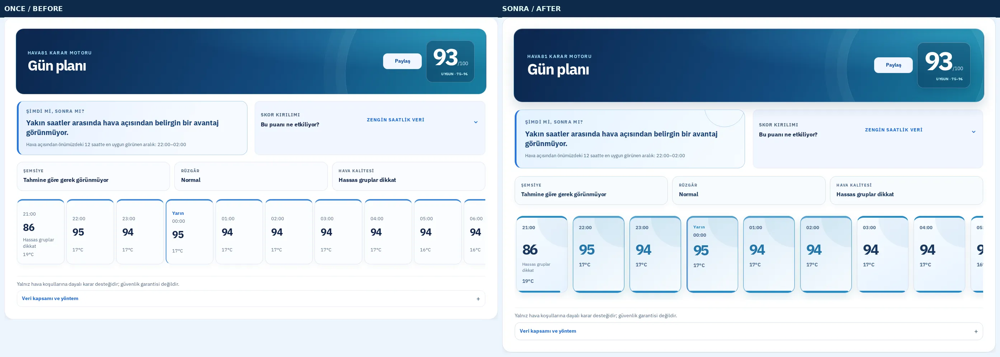
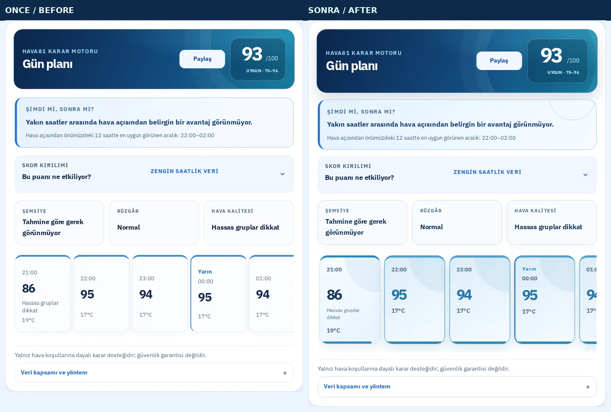
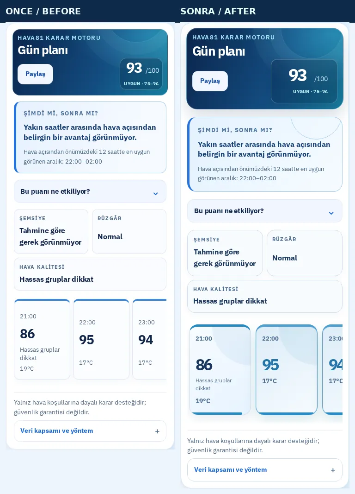
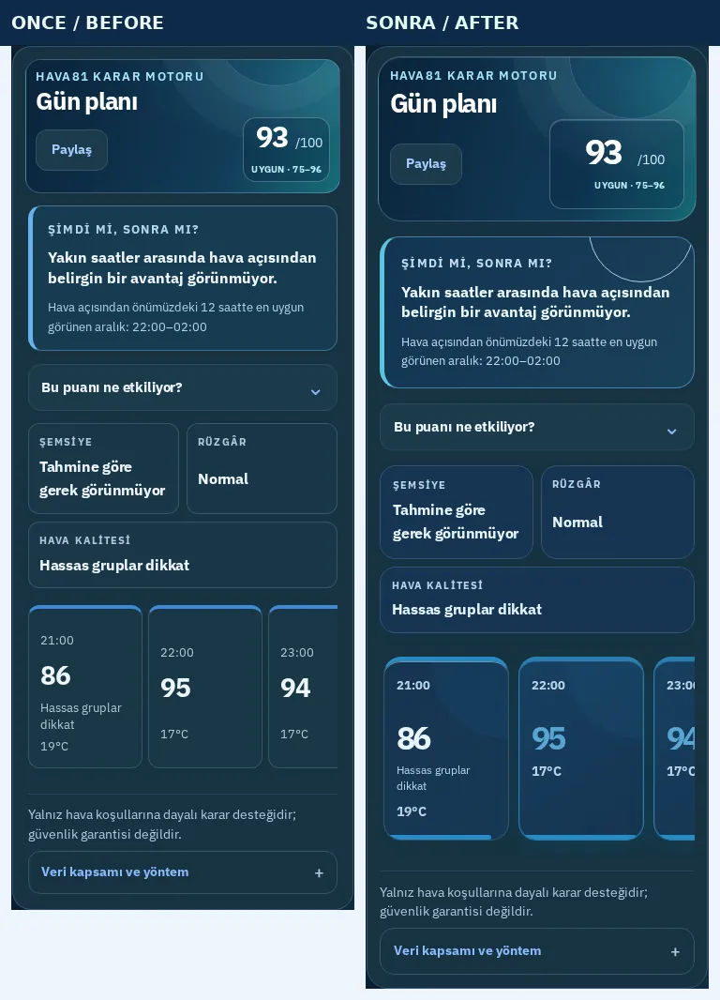
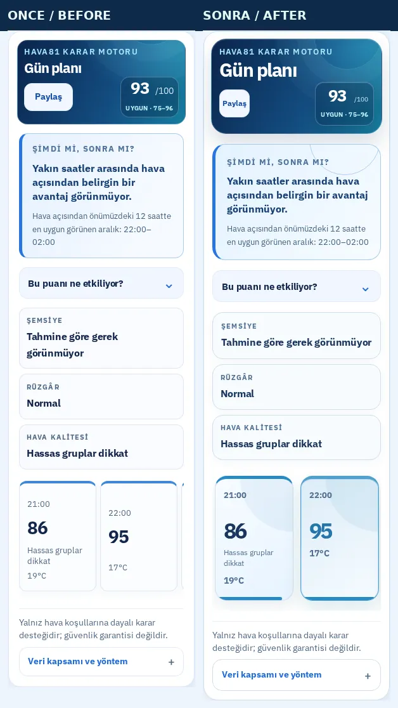
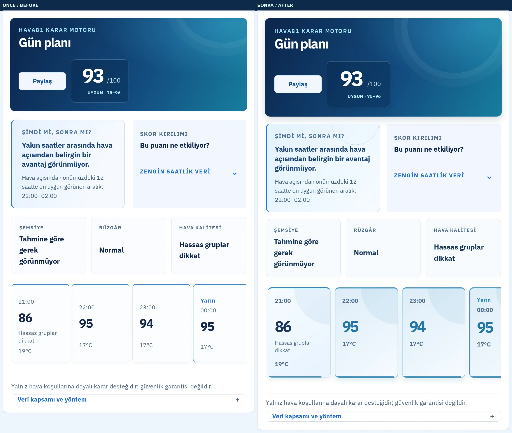
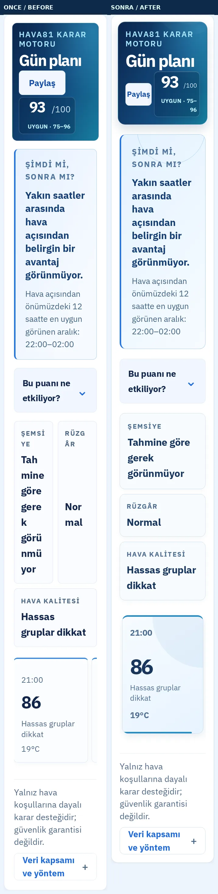

# Hava81 — Gün Planı: Premium Saatlik Karar Kartları

**Tarih:** 9 Ekim 2026

**Dal:** `feat/dayplan-timeline-editorial-20261009`

**Başlangıç:** `main`, PR #1297 sonrası.

## Görsel farklar (ÖNCE → SONRA)

1. **12 saatlik puan zaman çizelgesi:** Sıradan, eşit ağırlıklı küçük paneller → geniş, atmosferik gökyüzü kartları; skorlar çok daha büyük, okunur ve tabular.
2. **En iyi saat:** Sadece metindeki tavsiye → puanlama motorunun belirlediği gerçek zaman aralığındaki kartlara seçili durum, yeşil/teal vurgu ve renk ayrımı.
3. **Puan kıyaslaması:** Yalnızca sayı → kart altında `0–100` ölçeğinde görsel meter; hesaplama veya skor değeri değişmez.
4. **Hava koşulları:** Tekdüze üst çizgiler → puan bandına göre kontrollü yeşil/mavi/amber/kırmızı vurgu, okunaklı yardımcı veriler.
5. **Gün dönümü:** Dar sınır çizgisi → gün etiketi, ayrı sınır ve daha güçlü saat tipografisi.
6. **Mobil:** Daha büyük dokunulabilir kartlar ve sağa kaydırılabilen 12 saatlik zaman çizelgesi korunur; sayfanın kendisi yatay taşmaz.
7. **Koyu tema:** Yüksek kontrastlı metin, koyu gökyüzü yüzeyleri, temaya uygun vurgu kartları.
8. **%200 yazı:** Dar genişlikte üç karar özeti yan yana sıkışmak yerine tek sütuna iner; skor paneli daralmaya uyum sağlar.
9. **Erişilebilirlik:** Liste semantiği, her saat için `aria-label`, klavye ile kaydırılabilen zaman çizelgesi, azaltılmış hareket ve forced-colors korunur.
10. **Karar motoru:** Sıcaklık ve yağış verileri, 12 saatlik skor sırası, en iyi zaman hesabı ve veri kaynağı değişmeden kalır.

## Gerçek Playwright görüntüleri

Aşağıdaki dosyalar **gerçek Chromium** ile aynı ekran genişliklerinde alınan, sol tarafı canlı siteden **ÖNCE**, sağ tarafı yeni üretim önizlemesinden **SONRA** karşılaştırmalardır. Her görüntü aynı şehir ve iki durum için hava API'sinin gerçek yanıtlarını kullanır. Hava verilerinin canlı olarak yenilenmesi puan sayılarında küçük farklara yol açabilir; puanlama algoritması değiştirilmemiştir.

| Senaryo | Önce / Sonra |
|---|---|
| Masaüstü 1440 px, açık |  |
| Tablet 768 px, açık |  |
| Mobil 390 px, açık |  |
| Mobil 390 px, koyu |  |
| 320 px küçük telefon, açık |  |
| Masaüstü 1280 px, %200 metin |  |
| Mobil 390 px, %200 metin |  |

## Doğrulama

- TypeScript ve ESLint: **başarılı**.
- Vite üretim derlemesi: **başarılı**; 81 şehir giriş sayfası üretimi de başarılı.
- Vitest: **763 / 763**, 108 dosya başarılı.
- Hedef Playwright kontrolleri: **5 başarılı**, 7 cihaz/koşul filtresiyle atlandı.
- Gerçek ekran ve tema çekimi: normal masaüstü/tablet/mobil, koyu tema, 320 px, %200 metin; Chromium test raporu yerel `.visual-dayplan/final-captures/audit.json` dosyasında.
- Yalnızca bu ekran için eklenen kod: `src/styles/DailyTimelineEditorial.css`, `src/components/hava81/DailyPlanPanel.tsx`, CSS kaydını yapan `src/App.tsx` ve yeni Playwright regresyon testi.
- GitHub CI/CD, CodeQL, browser flows ve Lighthouse yeşil olmadan PR birleştirilmez.
- `/home/ubuntu/Hava81-latest` içindeki üç commit edilmemiş dosyaya dokunulmamıştır.

### Yeniden üretim

`HAVA81_DAYPLAN_AFTER_URL=http://127.0.0.1:45987 PLAYWRIGHT_BROWSERS_PATH=... node scripts/capture-dayplan-editorial.mjs`

Öncesi/sonrası URL'leri, `HAVA81_DAYPLAN_BEFORE_URL` ve `HAVA81_DAYPLAN_AFTER_URL` ile; çıktı dizini `HAVA81_DAYPLAN_OUTPUT` ile değiştirilebilir.
