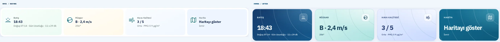
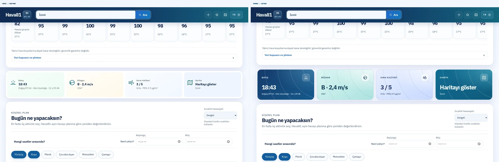
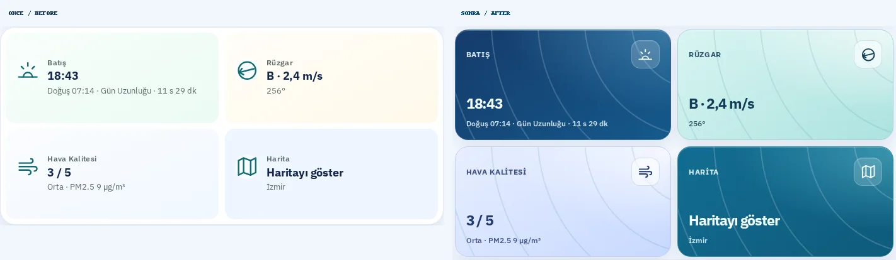
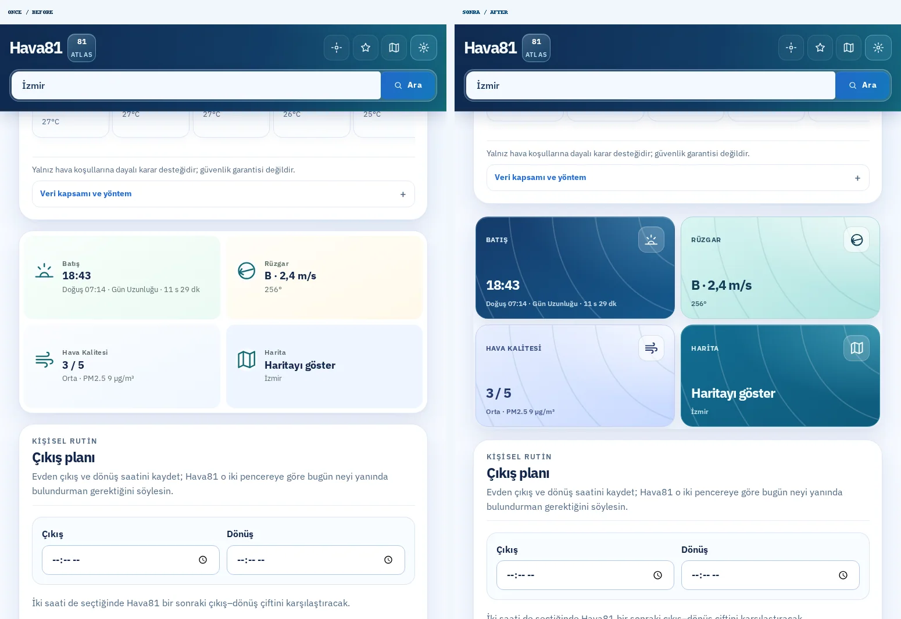
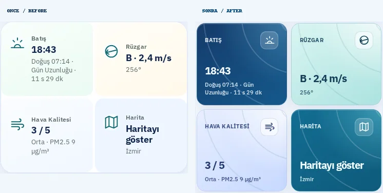
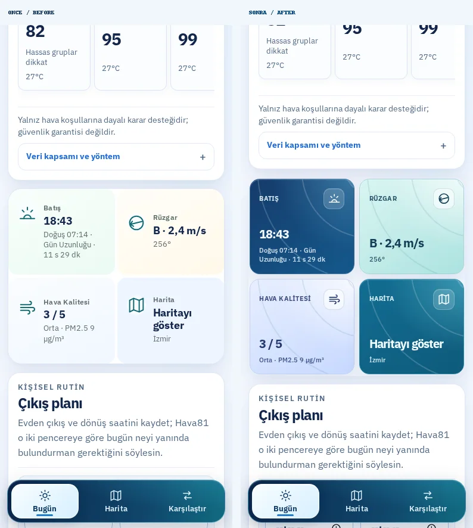
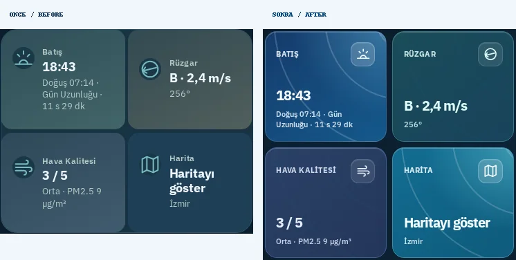
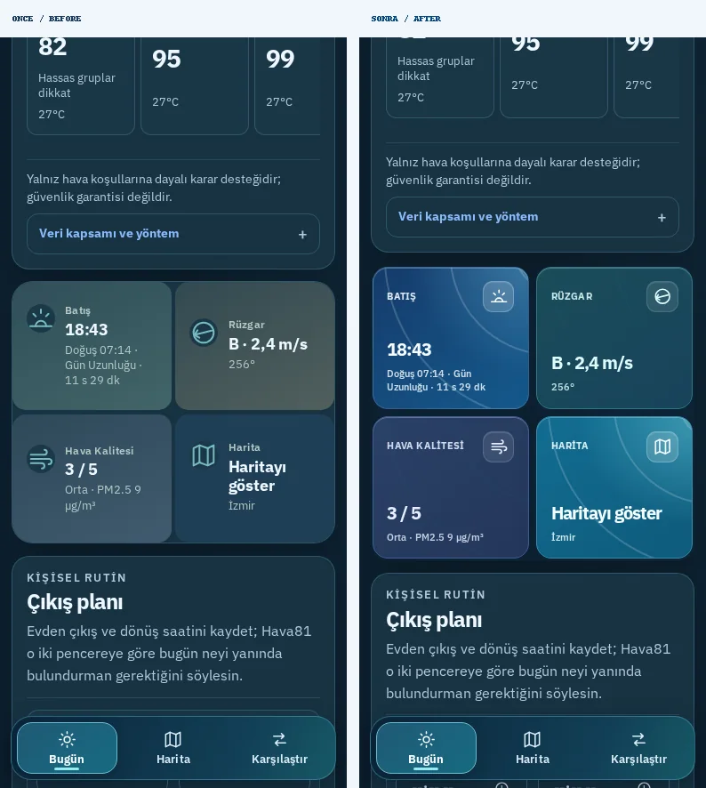
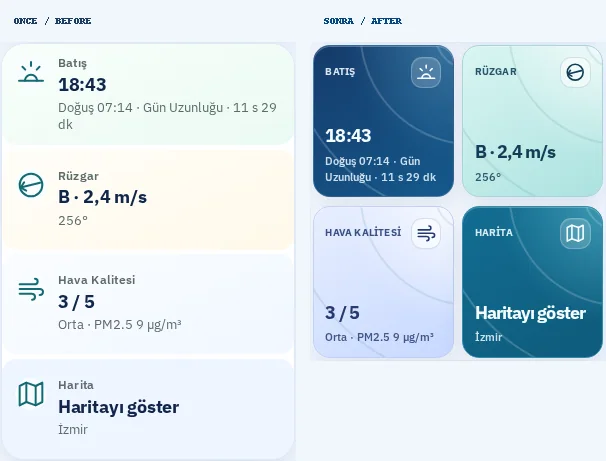
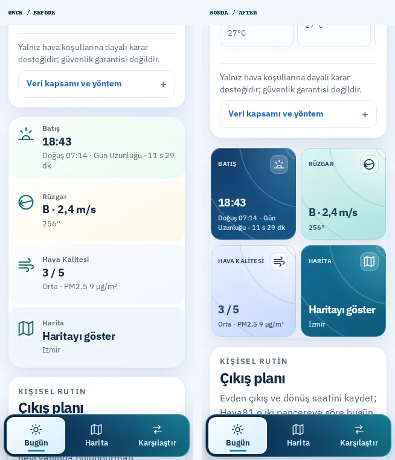

# Hava81 — Çevre Kartları / Atmospheric Bento

**Tarih:** 9 Ekim 2026
**Branch:** `feat/environment-metrics-bento-20261009`
**Başlangıç:** `main` commit `e3b7ec8` (PR #1291 sonrası).
**Kapsam:** Gün batımı, rüzgâr, hava kalitesi ve harita navigasyonu için görünür tasarım yenilemesi.

## Önce → Sonra: Madde madde değişiklikler

1. **Dört kartın temeli:** Soluk pastel metrik çubukları → ayrı gölgeli, yuvarlak köşeli premium bento kartları.
2. **Gün batımı:** Küçük sembol ve saat → lacivert gökyüzü gradyanı üstünde büyük, tabular saat ve kontrastlı açıklama.
3. **Rüzgâr:** Düz sarı kart → turkuaz/mint yüzey, güçlü yön+hız gösterimi, kolay okunur derece.
4. **Hava kalitesi:** Soluk gri kart → buz mavisi/lila tonları, büyük AQI değeri ve ayrı PM2.5 açıklaması.
5. **Harita aksiyonu:** Sade açık mavi karo → petrol mavisi çağrı kartı, belirgin tıklanabilirlik ve gölge.
6. **İkon yerleşimi:** Başlıkların solundaki dar sütun → her kartın sağ üstünde yarı saydam, büyük ikon kutusu.
7. **Grafik derinliği:** Düz dolgu → ince atmosferik kontur çizgileri ve tonal geçişler. Görsel motifler etkileşimleri engellemiyor.
8. **Masaüstü hiyerarşisi:** Dört eş kutu korunurken yüksek kontrast ve değer odaklı tipografiye geçildi.
9. **Mobil:** 390px'de 2×2 bento; 320px'de sıkı yerleşim. **%200 metin büyütmede** kartlar sığması için tam genişliğe geçerek okunabilirliği koruyor.
10. **Koyu tema / erişilebilirlik:** Ayrı koyu mint ve koyu mor renkler, görünür klavye odağı, forced-colors konturları, reduced-motion. Hava verisi, birimler, AQI ve map açma mantığı değiştirilmedi.

## Playwright gerçek ekran görüntüleri

Her görselin **solunda ÖNCE**, **sağında SONRA** vardır. Önce kaynak: [canlı Hava81](https://hava81.zekiakgul.dev/izmir/); sonra kaynak: main'den açılan ayrı Vite production-preview. Önce ve sonra aynı ekran boyutu ve temalarda gerçek Chromium ile alındı. Canlı veri kaynakları nedeniyle sayısal sıcaklık / güncelleme anı farklı olabilir.

| Ekran | Kartlar (önce / sonra) | Sayfa içinde (önce / sonra) |
|---|---|---|
| Masaüstü · 1440px açık |  |  |
| Tablet · 768px açık |  |  |
| Mobil · 390px açık |  |  |
| Mobil · 390px koyu |  |  |
| Küçük mobil · 320px |  |  |

**10 yan yana karşılaştırma** ve ham PNG dosyaları:\
`/home/ubuntu/Hava81-environment-metrics-visual-20261009/test-results/environment-metrics/screens-final/`

**Tekrarlanabilir çekim:** `node scripts/capture-environment-metrics.mjs`; `HAVA81_ENV_BEFORE_URL`, `HAVA81_ENV_AFTER_URL`, `HAVA81_ENV_AUDIT_DIR` ile kaynaklar değiştirilebilir. `report.json` kart sayısını, ekran geometrisini, tema/boyutları, JavaScript hatalarını ve yatay taşmayı kaydeder. İzole preview, gerçek API cevaplarını kullanır.

## Test ve güvenlik kapıları

- TypeScript: ✅ Başarılı.
- ESLint: ✅ Başarılı.
- Production build: ✅ Başarılı.
- Birim testleri: ✅ **763/763**, 108 dosya.
- Hedef Playwright: ✅ **4/4**, 320, 360, 390, 768, 1440px ve 100%/200% yazı testleri dahil.
- Görsel yakalama: ✅ **10/10**, yatay taşma ve JS pageerror yok.
- En dar ekranlarda odak ve ikon/metin çakışmama doğrulandı.
- GitHub CI/CD ve CodeQL: PR açıldıktan sonra kontrol edilecek.
- **GitHub kontrolleri başarılı olmadan squash merge veya canlıya alma yapılmayacak.**
- `/home/ubuntu/Hava81-latest` içindeki üç commit edilmemiş kullanıcı dosyası değiştirilmedi.
