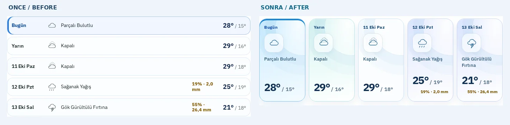
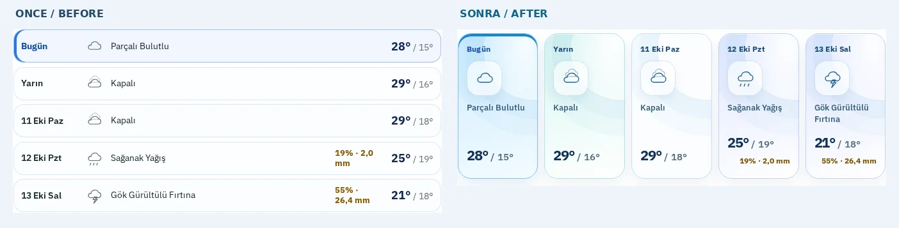
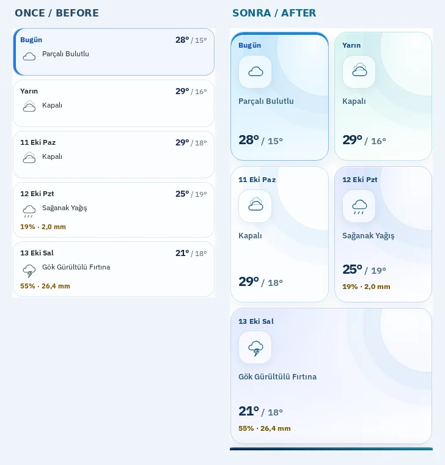
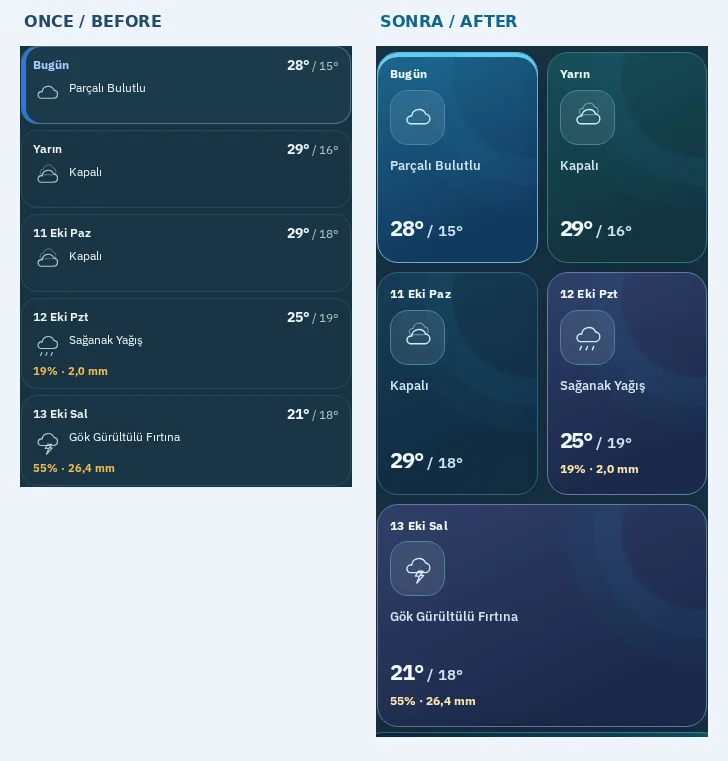
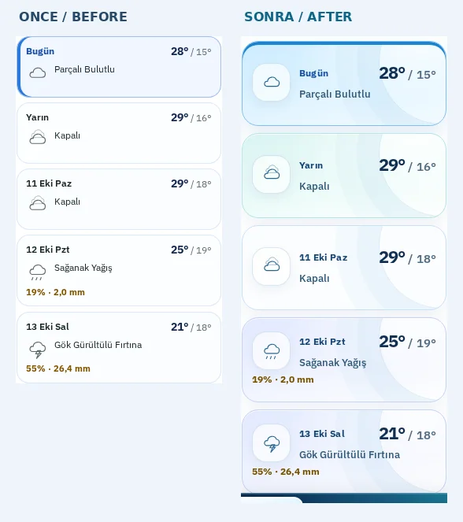
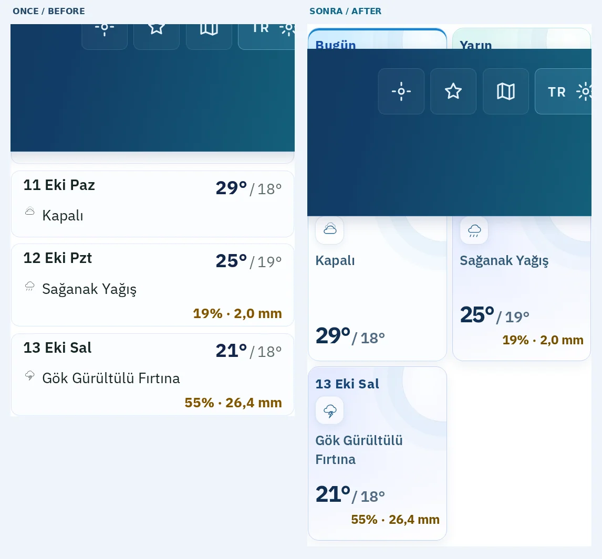

# Hava81 — Beş Günlük Gökyüzü Takvimi

**Tarih:** 9 Ekim 2026

**Geliştirme dalı:** `feat/forecast-sky-calendar-20261009`

**Temel sürüm:** `bd819e9` (PR #1293 sonrasında)

## Görsel hedef ve yapılan değişiklikler

1. Düz ve birbirine benzeyen **beş günlük tahmin satırları** beş ayrı, hava durumuna özgü **gökyüzü takvim kartına** dönüştürüldü.
2. Masaüstünde ve tablette beş gün bir arada, yatay kaydırma gerektirmeyen **beş sütunlu** pano oluşturuldu.
3. Bugün kartında belirgin mavi üst vurgu ve daha kuvvetli kontrast kullanıldı.
4. İkinci kart için mint, yağış sinyali taşıyan kartlar için mor/lila tonlar eklendi.
5. Hava simgeleri cam efektli karelerin içine alındı; sıcaklıklar görsel hiyerarşide öne çıkarıldı.
6. Gökyüzü çağrıştıran yarım daire katmanları ve yumuşak gradyanlar eklendi.
7. 390 px mobilde iki sütun ve son kartın tam genişlikte kullanılmasıyla içerik dengelendi.
8. 320 px mobilde daha okunur tek sütunlu, yatay hizalı kompakt kartlara geçildi.
9. Koyu tema için ayrı lacivert–petrol–mor palet ve açık renkli metinler kullanıldı.
10. %200 yazı büyütme, reduced-motion ve forced-colors senaryoları için uyarlanabilir yerleşim ve görünür konturlar korundu.

Tüm değişiklikler **yalnızca sunum katmanındadır**. API, sıcaklık/yağış hesaplamaları, hava tahmini dönüştürmeleri, klavye gezinme yapısı veya uygulama verileri değiştirilmedi.

## Gerçek Playwright ÖNCE / SONRA kanıtı

Karşılaştırmalarda **sol taraf önceki canlı site**, **sağ taraf izole production-preview** sürümüdür. Her iki taraf aynı ekran boyutu, dil ve tema ayarlarında gerçek Chromium ile çekilmiştir.

| Ekran | ÖNCE → SONRA |
|---|---|
| Masaüstü · 1440 px · açık |  |
| Tablet · 768 px · açık |  |
| Mobil · 390 px · açık |  |
| Mobil · 390 px · koyu |  |
| Küçük mobil · 320 px · açık |  |
| %200 yazı · 1280 px · açık |  |

## Yerel doğrulama

- TypeScript: ✅
- ESLint: ✅
- Production build / 81 şehir SEO kabuğu: ✅
- Vitest: **763 / 763** test, 108 test dosyası: ✅
- Playwright: **12 / 12** gerçek canlı/preview görsel senaryosu: ✅
- Her görünümde 5 günlük veri, yatay sayfa taşması ve metin kesilmesi kontrolü: ✅
- JavaScript pageerror: yok.
- Görsellerin tekrar üretilmesi: `HAVA81_FORECAST_AFTER_URL=http://127.0.0.1:4173 PLAYWRIGHT_BROWSERS_PATH=<chromium-browser-path> node scripts/capture-forecast-calendar.mjs`
- Ham PNG görüntüleri ve `report.json`: `test-results/forecast-calendar/visual/` (sunucuda çalışma çıktıları).
- Kalıcı görsel arşivi: bu klasördeki 6 adet yan yana WebP.

**Güvenlik:** Kod ayrı Git worktree'de geliştirildi. `/home/ubuntu/Hava81-latest` içerisindeki kullanıcının üç commit edilmemiş dosyasına dokunulmadı. GitHub **CI/CD + CodeQL** tamamen başarılı olmadan PR squash merge yapılmamalıdır.
