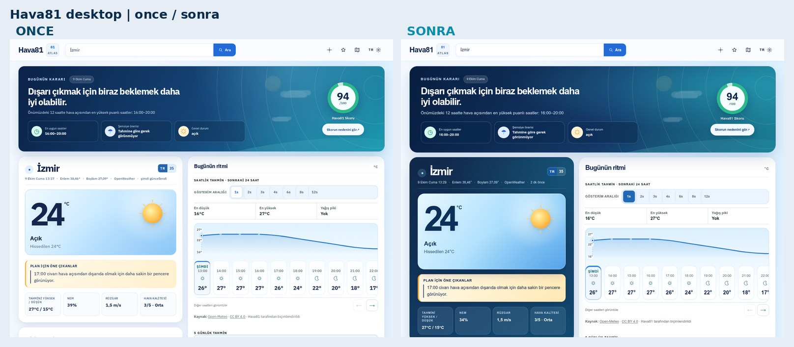
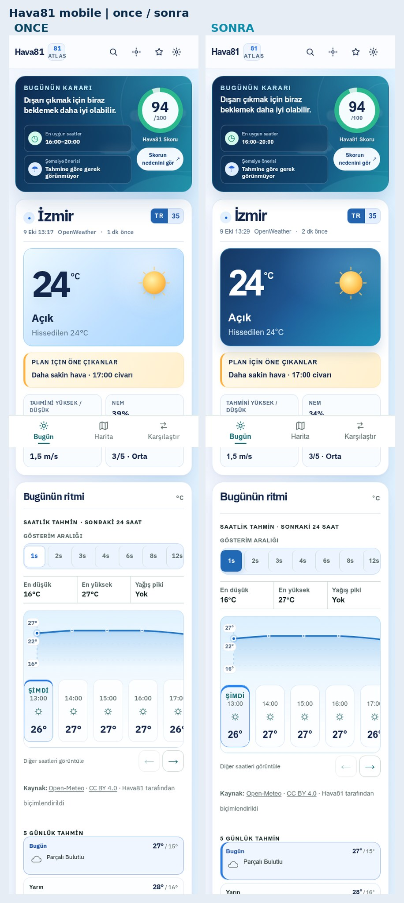
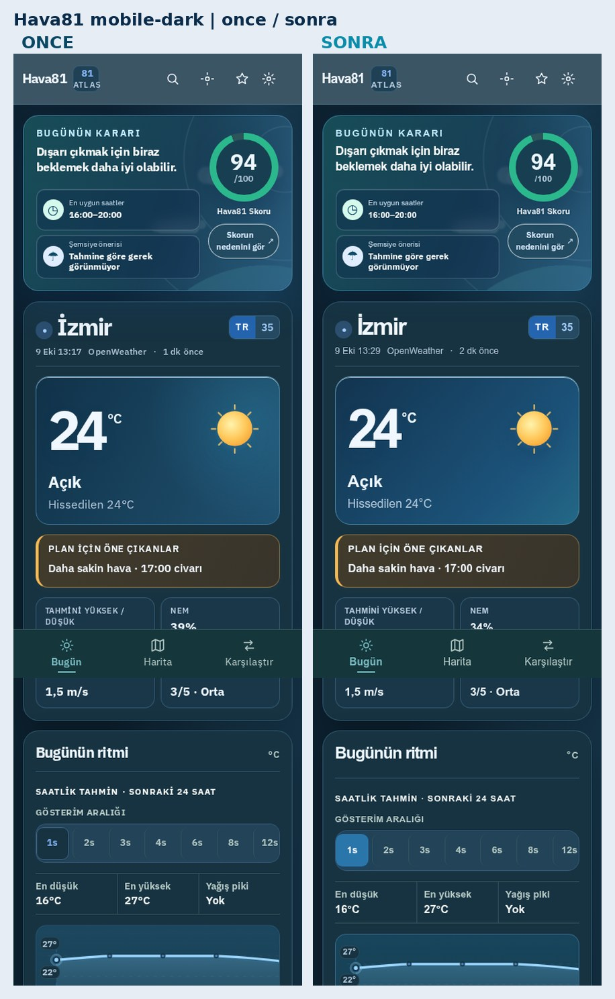

# Hava81 Home Editorial Refresh — 9 October 2026

## Objective

Make the *first screen* feel like a purposeful, premium weather dashboard, not a grid of visually identical paper cards. Prioritize a clearly visible desktop **and** mobile difference while keeping weather facts, navigation and accessibility intact.

The initial visual baseline was `main` commit `977d208` (#1286); the branch was then rebased onto current `main` commit `72e5a31` (#1287). Feature branch: `feat/home-editorial-refresh-20261009`. The original `/home/ubuntu/Hava81-latest` worktree and all three existing uncommitted changes remain untouched.

## Before → after change register

1. **Desktop current weather instrument:** white card housing a pale temperature widget → full deep-ocean panel with clean white city identity, solid-color metadata and four glassy weather-stat instruments.
2. **Temperature highlight:** low-contrast pale-blue tile → larger type, richer cyan sky gradients, reflective light, stronger frame and real weather symbol. All meteorological numbers remain unchanged.
3. **Current decision narrative:** ordinary bold line → stronger editorial first-fold typographic scale, tightened line breaks, premium navy masthead and distinct score-side action.
4. **At-a-glance guidance:** three faint blue summary tiles → raised translucent dark-glass status blocks inside the hero at desktop width.
5. **Forecast navigation:** low-contrast segmented hours → stronger blue selected hour, chart surface with a soft gradient and weather-hour capsules with legible selected boundaries.
6. **Five-day forecast:** understated flat rows → more tactile row separation and a more visible first-day signal.
7. **Mobile current weather:** familiar pale-blue panel → deep-blue-to-teal current-conditions poster with white temperature and secondary text, while the parent card and forecast remain light so dark blocks are not stacked.
8. **Theme/accessibility:** desktop treatment is restricted to light theme; dark-mode palettes preserve their existing contrast. Small-screen rules preserve city names, 44px targets, score ring, scene opacity fade under 200% text, semantic button states, forced-colors and reduced-motion affordances.

**No API, translations, weather calculations, navigation or model behavior changes.** CSS-only addition plus one CSS import.

## Quick before / after preview

**Desktop — first fold:**

**Mobile — first fold and hourly forecast:**

**Mobile dark theme:**

## Playwright screenshots

`docs/visual-reviews/home-editorial-20261009/`

Paired before/after captures (before = currently deployed production, after = isolated locally served latest code):

| Variant | Before | After |
|---|---|---|
| Desktop 1440×900 viewport | before-desktop-light.webp | after-desktop-light.webp |
| Tablet 768×1024 viewport | before-tablet-light.webp | after-tablet-light.webp |
| Mobile 390×844 viewport | before-mobile-light.webp | after-mobile-light.webp |
| Mobile dark 390×844 viewport | before-mobile-dark.webp | after-mobile-dark.webp |
| Small phone 320×720 viewport | before-small-mobile.webp | after-small-mobile.webp |

The files are **full-page** captures, not mockups. Weather observations may update between captures, so temperature and best-hour recommendations are not visual-design changes.

The capture command uses `scripts/capture-visual-audit.mjs`; it checks HTTP 200, captures the city/forecast and records rendered viewport width and JavaScript errors. Real read-only weather API responses are used by the preview. Screenshots and the full JSON report remain available in the isolated server scratch directory `/tmp/hava81-home-editorial-20261009`.

## Completed local checks

- TypeScript, ESLint and production build: passed.
- Unit test suite: passed.
- Playwright responsive capture: 5/5 viewport/theme combinations passed for both production baseline and preview (10 captures); no JavaScript page exceptions or horizontal overflow.
- Targeted browser regressions: **5 passed** (hero, score artwork collision, 320px city / text zoom, atmospheric scene text zoom and mobile map focus).
- Follow-up CSS correction retains the existing opaque panel computed-style contract without losing the navy gradient appearance.
- The first GitHub browser suite flagged light-theme plate-label contrast. The **TR label backing was darkened to #1659a5** (the readable white text was kept). The full axe-core WCAG-AA color-contrast regression across 320px/390px/1440px and light/dark, Turkish/English was rerun locally and passed.

## Release gate

Before squash-merge, require:
- TypeScript `npm run type-check`
- ESLint `npm run lint`
- `npm run build` and 81-page static generation
- All unit tests `vitest run`
- Browser regression cases for the decision masthead and score/sun collision, enlarged mobile scenery/city, keyboard focus/controls, and every supported viewport
- GitHub CI/CD Pipeline and CodeQL on the exact PR head
- Fresh `main` CI/CD and GitHub Pages deployment verification after squash-merge.

**Do not merge or deploy if any gate fails.**
