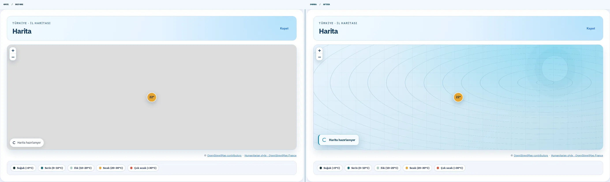
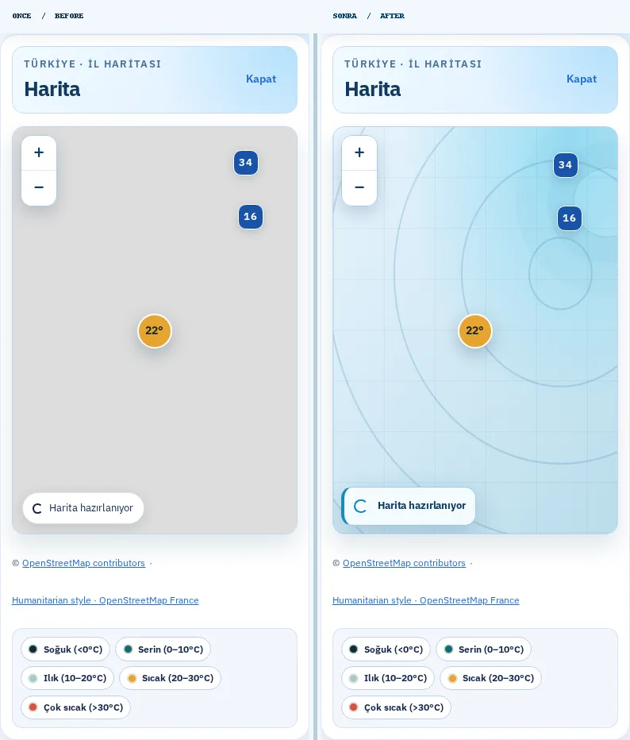
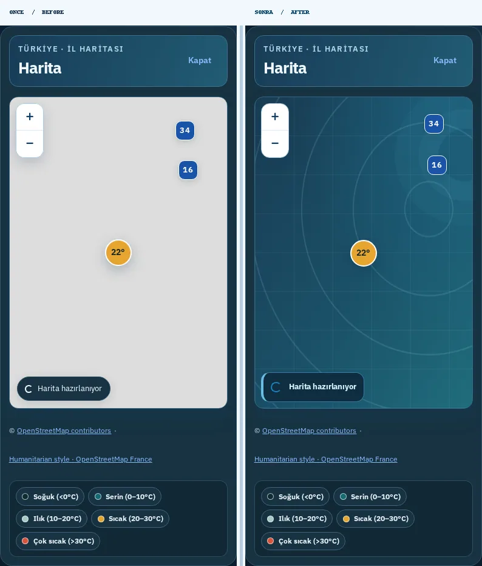
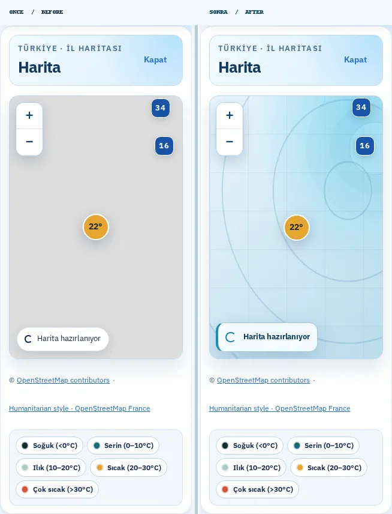
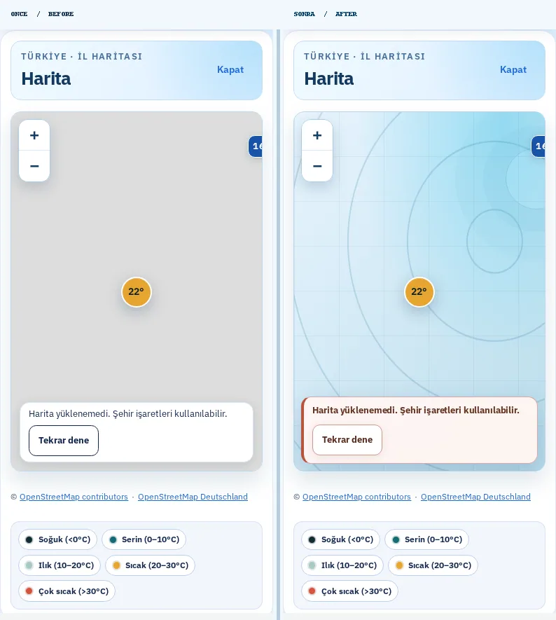

# Hava81 — Harita Yükleme ve Bağlantı Hatası Görsel Yenilemesi

**Tarih:** 9 Ekim 2026
**Çalışma dalı:** `feat/map-loading-visual-20261009`
**Kaynak:** İzole Git worktree; canlı üretim sitesindeki harita bölümü ve yeni production build karşılaştırıldı.

## Önce → Sonra: Görünür değişikliklerin kaydı

1. **Boş harita alanı:** Belirsiz, düz gri alan yerine açık mavi–turkuaz *dekoratif* arka plan.
2. **Harita dokusu:** Boş görünümü saklayan değil, haritanın yüklendiğini açıkça gösteren, ince çizgili seyrüsefer-estetiği konturları. Bunlar **gerçek coğrafi veri, yağış veya hava haritası değil**.
3. **Yükleme durumu:** Beyaz sıradan etiket yerine mavi sol vurgu çizgili, cam görünümlü, okunaklı “Harita hazırlanıyor” paneli.
4. **Yükleme animasyonu:** Daha belirgin mavi dönen halka; hareket azaltma tercihinde animasyon yok.
5. **Bağlantı hatası:** İki kaynak da başarısız olunca ayrı sıcak tonlarda, yüksek kontrastlı bir hata paneli; mevcut **Tekrar dene** butonu belirginleştirildi.
6. **Koyu tema:** Ayrı koyu deniz mavisi, turkuaz çizgiler ve okunaklı durum göstergesi.
7. **Responsive:** 1440px, 390px ve 320px, açık ve koyu tema için etiket genişliği, hizalama ve taşma kontrolleri.
8. **Katmanlama:** Gerçek OpenStreetMap döşemeleri yüklendiğinde görselleri her zaman dekoratif arka planın üzerinde kalır. Harita işaretleri ve yakınlaştırma kontrolleri kullanılabilir.
9. **Erişilebilirlik:** `status` / `alert` semantiği değişmedi, bilgilendirme panelleri harita etkileşimlerini engellemiyor, zorlanmış yüksek kontrastta dekoratif desen gizleniyor.
10. **Veri güvenliği:** Hava durumu API'si, şehir verileri, rota hesaplamaları ve harita sağlayıcı URL'leri değiştirilmedi; yalnızca yükleme/hata tasarımı ve bunu doğrulayan testler eklendi.

## Playwright ile alınmış gerçek önce/sonra ekran görüntüleri

Her görselin **solu ÖNCE**, **sağı SONRA**. Her iki sürüm de gerçek Chromium'da açıldı; görsel karşılaştırmanın tekrarlanabilir olması için hava durumu API yanıtları ve harita döşemelerinin gecikmesi Playwright tarafından **sabit test senaryosu olarak** yönetildi. Bu görüntüler gerçek harita döşemelerini temsil etmez; sadece *harita yükleme ve hata durumu* tasarımını kıyaslar.

| Görünüm | Önce / Sonra |
|---|---|
| 1440 px masaüstü, açık tema |  |
| 390 px mobil, açık tema |  |
| 390 px mobil, koyu tema |  |
| 320 px küçük telefon, açık tema |  |
| 390 px mobil, iki harita sunucusu da başarısız |  |

Ham ekran görüntüleri ve `report.json`: `/home/ubuntu/Hava81-map-loading-visual-20261009/test-results/map-loading-visual/screens-verified/`.

Tekrar çekim: `node scripts/capture-map-tile-atmosphere.mjs`. İsteğe bağlı değişkenler: `HAVA81_BEFORE_URL`, `HAVA81_AFTER_URL`, `HAVA81_MAP_CAPTURE_DIR`.

## Kontrol listesi

- TypeScript: başarılı
- ESLint: başarılı
- Production build: başarılı
- Vitest: **763/763**, 108 test dosyası başarılı
- Hedefli Playwright: **6/6** (eski yedek sağlayıcı/retry testleri ve yeni görünüm testleri)
- Gerçek Chromium görsel denetimi: 5 önce/sonra çifti (4 geciktirilmiş döşeme, 1 iki sağlayıcının da başarısız olduğu durum), JS hatası ve yatay taşma olmadan
- `git diff --check`: başarılı
- GitHub CI/CD ve CodeQL: **PR açıldıktan sonra doğrulanacak**. Tamamı başarılı olmadan birleştirme veya yayınlama yapılmayacak.

**Koruma:** Ana çalışma dizini `/home/ubuntu/Hava81-latest` altındaki üç commit edilmemiş dosya değiştirilmedi, silinmedi veya sıfırlanmadı.
