# Hava81 — Premium Mobil Navigasyon Dock'u

**Tarih:** 9 Ekim 2026
**Feature branch:** `feat/mobile-dock-visual-20261009`
**Taban:** `main` / `23a0182` (PR #1290 — Premium Navigasyon birleştirildikten sonra)

## Önce / Sonra — gözle görülür değişiklikler

1. **Alt menü gövdesi:** Ekrana sıfırdan bitişik düz beyaz bant → köşelerden 12px içeri alınmış, lacivert–turkuaz gradyanlı, yuvarlatılmış ve yükseltilmiş kayan dock.
2. **Aktif sekme:** Sadece küçük bir alt çizgi → büyük, belirgin, açık mavi yüzeyli seçili kart. Kullanıcı o an *Bugün*, *Harita* ya da *Karşılaştır* ekranlarından hangisinde olduğunu tek bakışta görüyor.
3. **Simge ve tipografi:** Soluk ikonlar → belirgin açık renk simgeler, daha dengeli etiketler ve tutarlı dikey yerleşim.
4. **Koyu tema:** Basit koyu bant → petrol mavisi gradyan, seçili sekmede açık turkuaz görünüm ve ayrı kontrast ayarı.
5. **Uygulama ile bütünlük:** Yeni üst navigasyon ve karar kartlarının lacivert/turkuaz görsel dili mobil alt menüye de taşındı.
6. **Küçük telefon:** 320px genişlikte iç boşluk ve yuvarlatma daraltıldı; butonlar en az 44px dokunma genişliğini koruyor.
7. **%200 metin büyütme:** 320px ve 390px genişlikte Türkçe etiketler gerekirse kendi alanlarında satır kırıyor; İngilizce Today, Map ve Compare etiketleri ise %200 büyütmede bile tek satırda kalıyor.
8. **Ekran içeriğinin korunması:** Kayan dock'un kaplayacağı alan için mevcut sayfa alt boşluğu artırıldı, safe-area inset uyumluluğu korundu.
9. **Erişilebilirlik:** `aria-current="page"`, klavye gezinme, görünür odak ve forced-colors aktif sekme ayrımı korunuyor.
10. **İşlevsel kapsam:** Rota, hava tahminleri, şehir karşılaştırma, tıklama işleyicileri, API istekleri ve navigasyon hedefleri **değiştirilmedi**. Yeni kod yalnızca ek CSS katmanı ve Playwright görsel kanıt aracıdır.

## Playwright önce / sonra kayıtları

Görseller *gerçek Chromium tarayıcısından* alındı. Sol taraf **ÖNCE** (canlı Hava81), sağ taraf **SONRA** (bağımsız production preview). Alt navigasyon ve birinci ekran farklı boyutlarda kaydedildi.

| Ekran | Alt menü — Önce / Sonra | Tam ekran — Önce / Sonra |
|---|---|---|
| 390 px · açık | 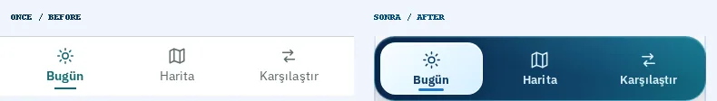 | 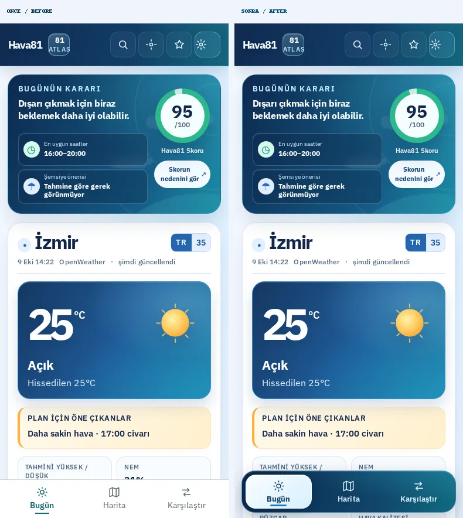 |
| 390 px · koyu | 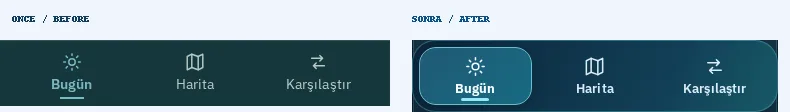 | 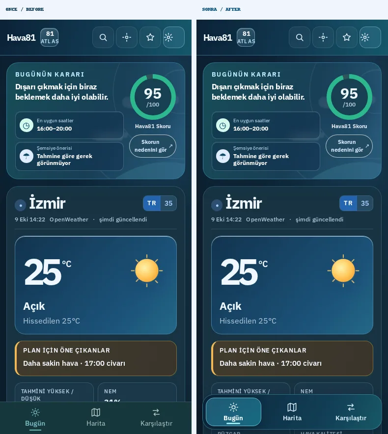 |
| 320 px · açık | 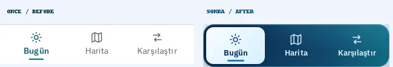 | 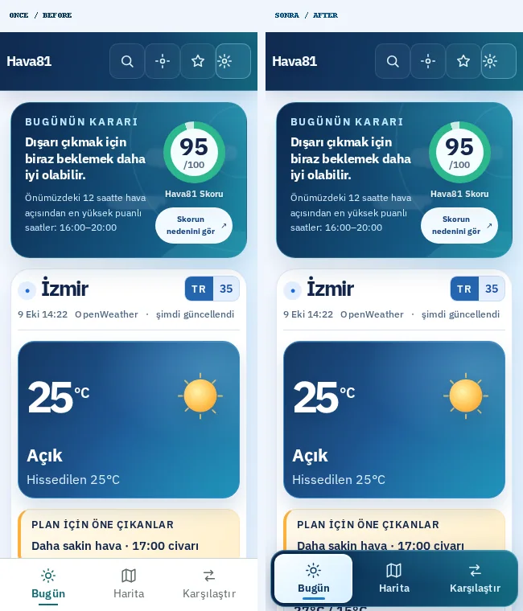 |
| 320 px · koyu | 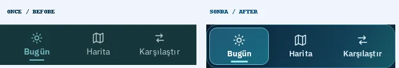 | 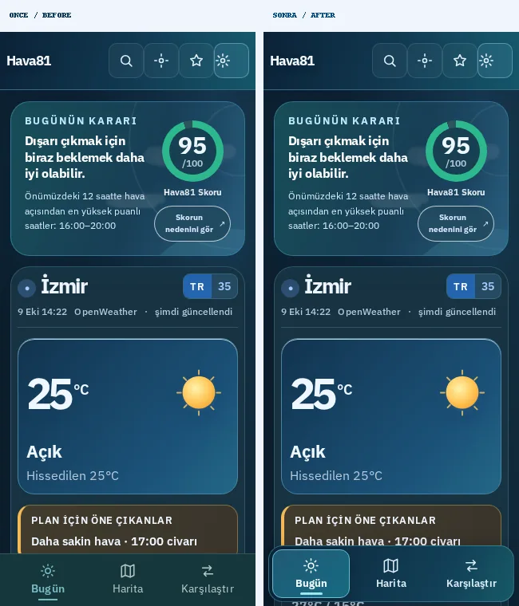 |
| 390 px · %200 metin | 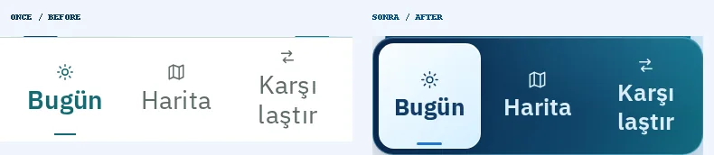 | 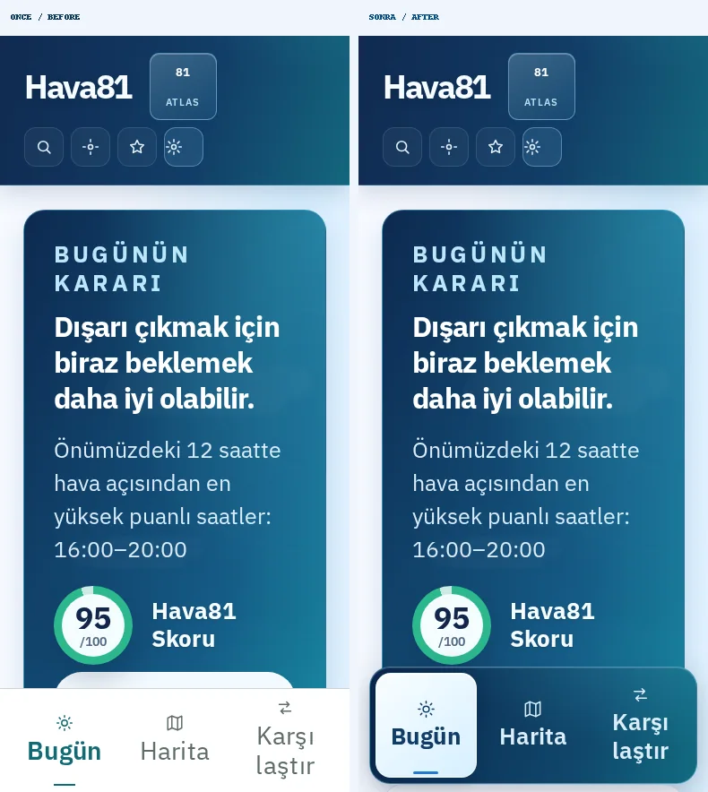 |
| 320 px · %200 metin | 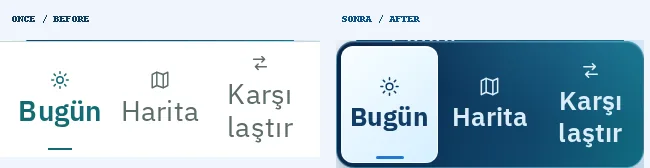 | 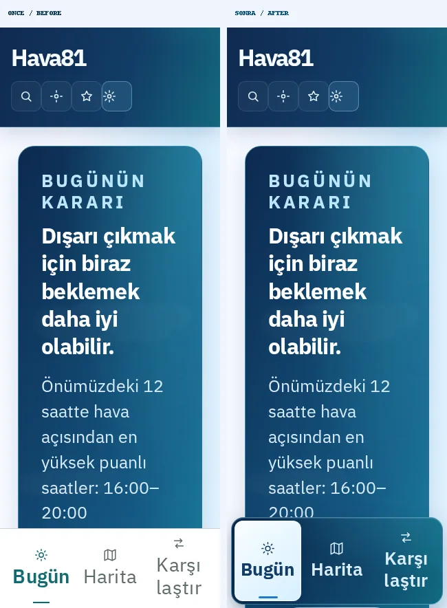 |

**Ham PNG ve kontrol raporu:** `/home/ubuntu/Hava81-mobile-dock-20261009/test-results/mobile-dock/screens/`. Yeniden çekim: `node scripts/capture-mobile-dock.mjs`.

## Test ve yayın kontrol listesi

- TypeScript, ESLint ve production Vite build: başarılı.
- Hedef Playwright: mobil klavye sırası, forced-colors seçili sekme, 320/360/390/428px ve %200 metin testi — 3/3 başlangıç testi geçti. Genişletilmiş gezinme testinde İngilizce Map etiketinin %200 büyütmede kırılması düzeltildi; toplam altı mobil gezinme akışı ayrıca yeniden test edildi.
- Görsel tarama: 12/12 senaryo (önce + sonra); her birinde HTTP 200, yatay taşma veya JavaScript hatası yok, minimum dokunma alanı ve etiket ayrımı sağlandı.
- Vitest: son tam koşu sonucu PR hazırlanırken teyit edilecek.
- GitHub CI/CD ve CodeQL: PR oluşturulduktan sonra çalışacak. **Tümü yeşil olmadan squash merge veya canlıya dağıtım yok.**

## Mevcut çalışmaların korunması

`/home/ubuntu/Hava81-latest` içindeki commit edilmemiş üç kullanıcı dosyasına dokunulmadı. Tüm geliştirmeler ayrı worktree içinde yapıldı.
