# Hava81 — Premium Üst Menü ve Şehir Arama Yenilemesi

**Tarih:** 9 Ekim 2026
**Geliştirme dalı:** `feat/navigation-premium-current-main-20261009`
**Taban:** güncel `main`, `979418f` — PR #1289 (premium ilk ekran) dahil.
**Kapsam:** görsel CSS, React dosyasına stil import'u ve Playwright ekran yakalama aracı; API, arama mantığı veya kullanıcı tercihleri değiştirilmedi.

## Önce → Sonra: Görünür değişiklik kaydı

1. **Üst gezinme şeridi:** Düz beyaz üst bant → koyu lacivert–turkuaz atmosfer geçişi; premium dashboard ile uyumlu arka plan ve gölge.
2. **Logo ve Hava81 Atlas işareti:** Soluk dikdörtgen → buz mavisi kenarlı, koyu saydam Atlas rozeti; beyaz marka yazısı ve daha keskin tipografi.
3. **Arama yüzeyi:** Sıradan beyaz alan → tek parça cam efektli arama kapsülü, koyu mavi çerçeve ve kontrollü yükseklik.
4. **Ara düğmesi:** Dar ve ayrık → mavi gradyanlı, dolu renkli, daha kolay fark edilir eylem düğmesi.
5. **Şehir önerileri:** Klasik düz liste → yuvarlatılmış, gölgeli açılır panel; seçili öneri belirgin, klavye navigasyonu korunuyor.
6. **Hızlı aksiyonlar:** İnce, açık renk simgeler → eş ölçülü koyu cam tuşlar; konum, favori, harita, tema ve dil düğmeleri kendi görsel alanlarında.
7. **Mobil deneyim:** 390 px ve 320 px ekranlarda düğmelerin düzenli hizalanması, aramanın açılınca ayrı bir satırda belirmesi.
8. **Koyu mod:** Üst menüde ayrı koyu lacivert–petrol tonları, buton vurgu ve çerçeve kontrastı.
9. **%200 metin büyütme:** 1280 px masaüstünde şehir araması başlıktaki aksiyonlara çarpmadan ikinci satıra geçiyor; 568×320 yatay telefonda öneriler ekran içinde kaydırılabilir kalıyor.
10. **Kullanılabilirlik:** 44 px mobil tuşlar, görünür klavye odağı, yüksek kontrast / forced-colors durumları ve hareket azaltma tercihi korundu.

## Playwright ile kaydedilen gerçek önce / sonra görselleri

Her görselin **sol tarafı ÖNCE**, **sağ tarafı SONRA**. Eski görünüm canlı `https://hava81.zekiakgul.dev/izmir/` üzerinden, yeni görünüm ise `main` commit `979418f` tabanlı izole production preview üzerinden gerçek Chromium ile çekildi. Değişiklikler aynı beş ekran/tema boyutunda karşılaştırıldı. Gerçek hava sıcaklığı ve güncelleme zamanı birkaç dakika arasında farklılık gösterebilir.

| Ekran | Üst menü | Şehir araması / öneriler | İlk ekran |
|---|---|---|---|
| Masaüstü (1440 px) · açık | 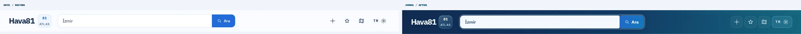 | 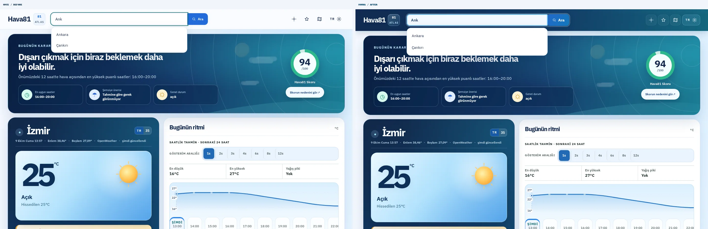 | 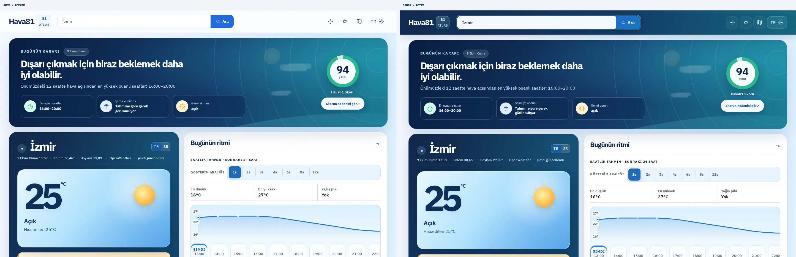 |
| Tablet (768 px) · açık | 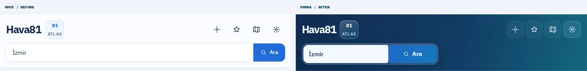 | 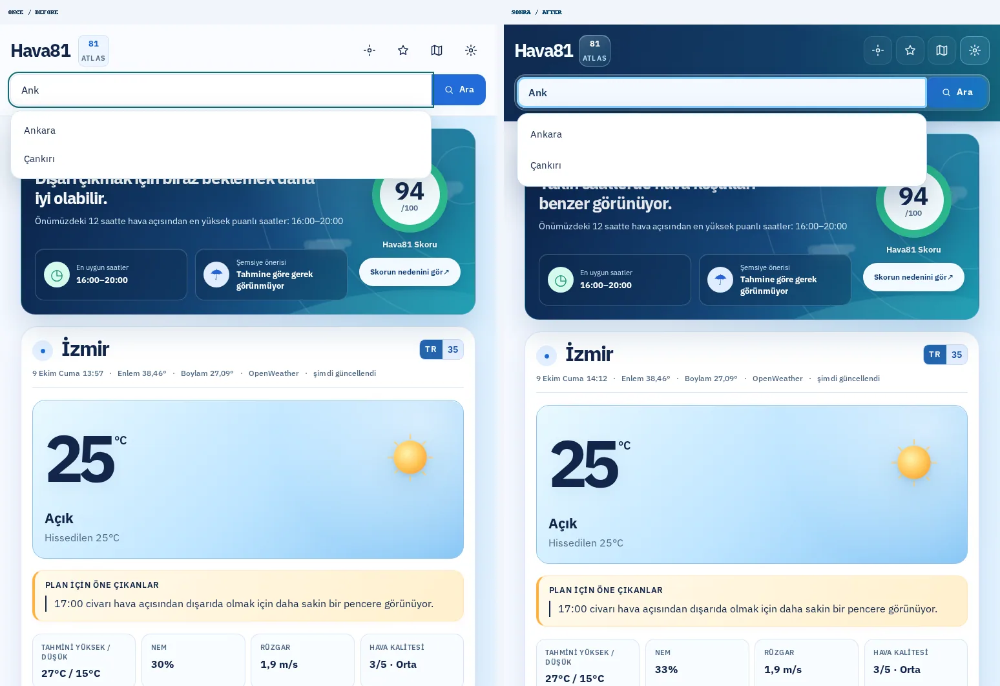 | 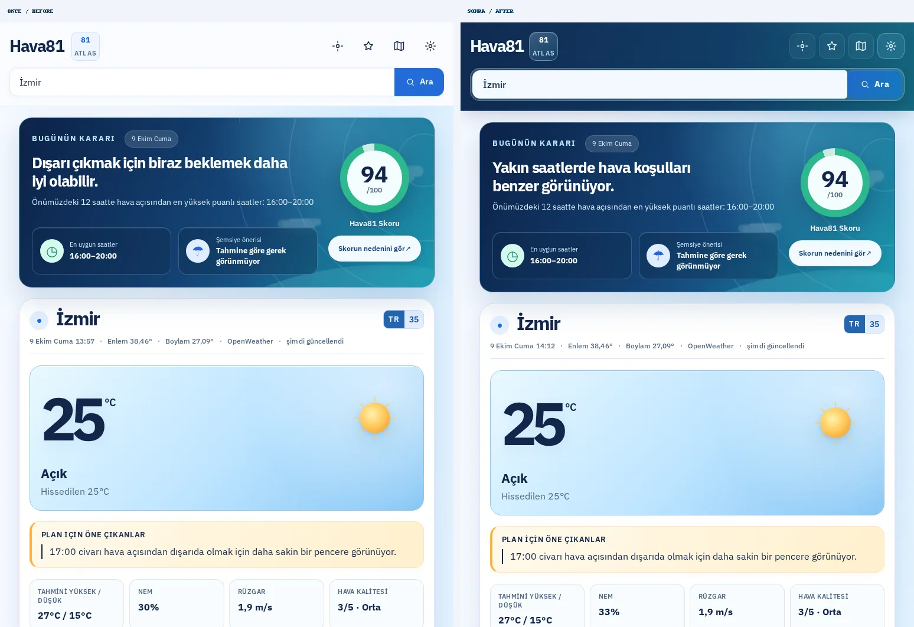 |
| Mobil (390 px) · açık | 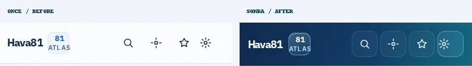 | 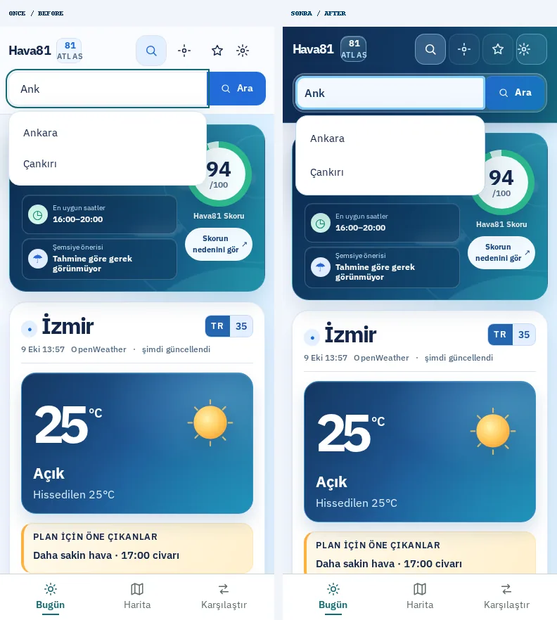 | 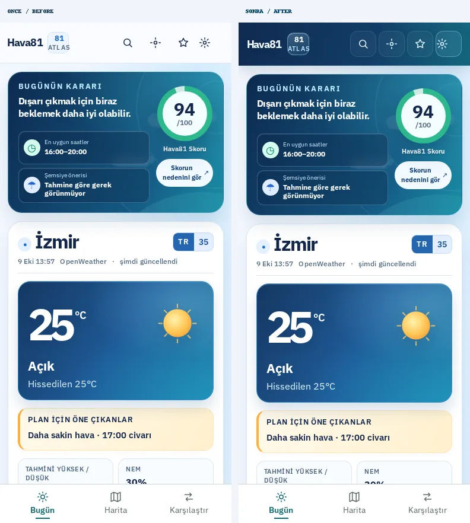 |
| Mobil (390 px) · koyu | 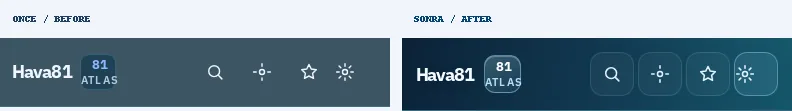 | 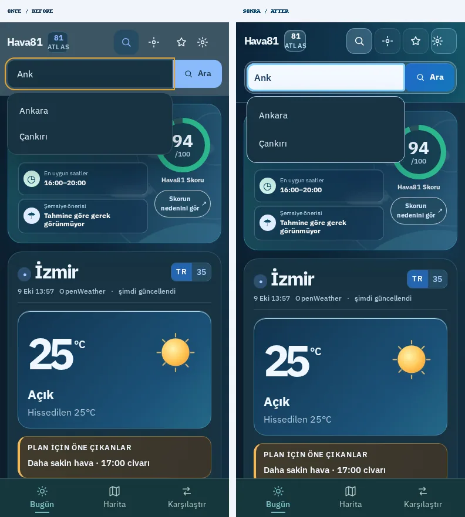 | 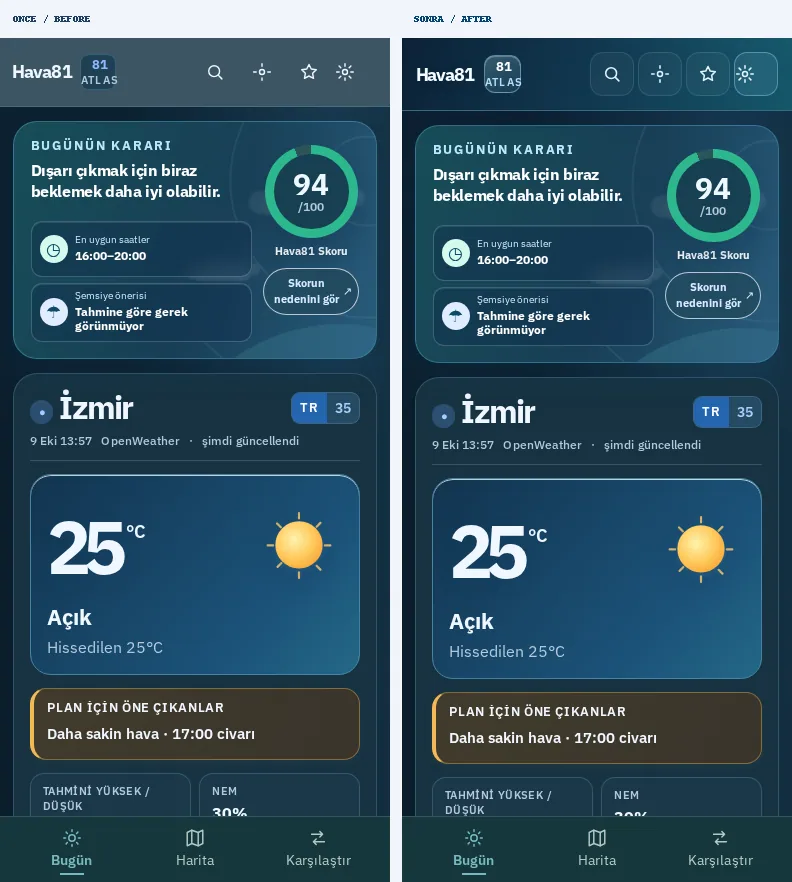 |
| Küçük telefon (320 px) · açık | 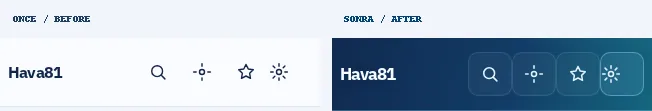 | 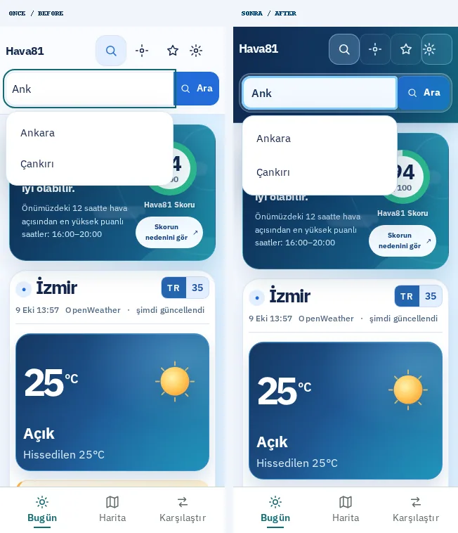 | 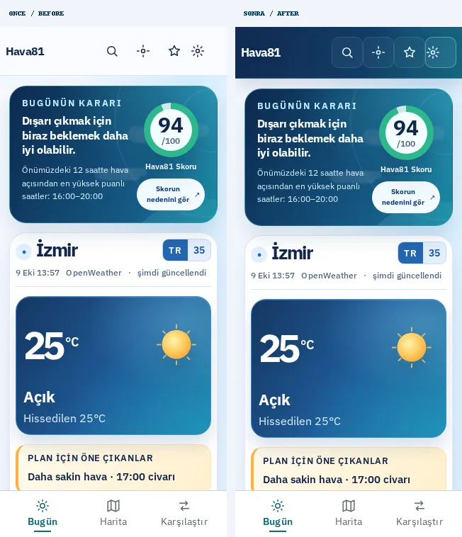 |

**15 adet yan yana görsel karşılaştırması** GitHub'da bu dosyanın yanındadır. Ham PNG ekran görüntüleri, JS hata kayıtları, alan geometrisi ve `report.json` sunucuda: `/home/ubuntu/Hava81-navigation-main-20261009/test-results/navigation-visual/screens/`.

Playwright çekimini yenilemek için `node scripts/capture-navigation-visual.mjs` kullanılabilir. `HAVA81_BEFORE_URL`, `HAVA81_AFTER_URL` ve `HAVA81_VISUAL_DIR` desteklenir. Canlı arama önerileri gerçek API'den alınır; sahte şehir verileri kullanılmaz.

## Yerel doğrulama

- **TypeScript:** Başarılı.
- **ESLint:** Başarılı.
- **Production Vite build:** Başarılı.
- **Vitest:** **763 / 763**, 108 dosya başarılı.
- **Playwright ekran/tema taraması:** **10 / 10** (önce + sonra), HTTP 200, öneriler görünür, JavaScript hatası ve yatay taşma yok.
- **Playwright erişilebilirlik:** şehir önerileri, kısa masaüstü ve yatay telefon, %200 metin büyütme, ayarlar düğmesinin erişilebilirliği, zorlanmış kontrast, odak ve mobil aksiyonlar.
- **Git diff --check:** Başarılı.
- **GitHub ilk Browser flows taramasında bulunan 2 stil regresyonu:** 768 px tablette arama genişliği düzeltildi; yeni koyu tema düğmesinin beyaz metni için görsel E2E beklentisi güncellendi. Üç ilgili test yerelde geçti. Tablet karşılaştırma görselleri düzeltme sonrası yeniden çekildi.
- **GitHub CI/CD ve CodeQL:** PR açıldıktan sonra doğrulanacak. **Tamamı başarılı olmadan squash merge veya dağıtım yapılmayacak.**

**Koruma:** `/home/ubuntu/Hava81-latest` içindeki üç commit edilmemiş dosya silinmedi, değiştirilmedi veya resetlenmedi. Geliştirme ayrı worktree'de yapıldı.
