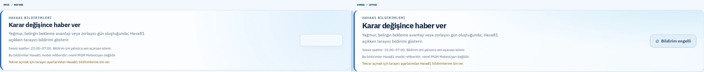
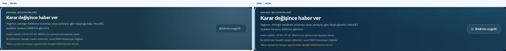
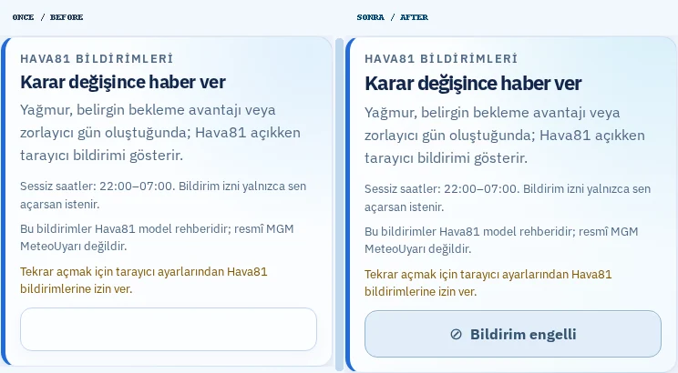
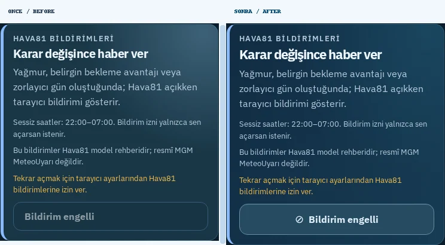
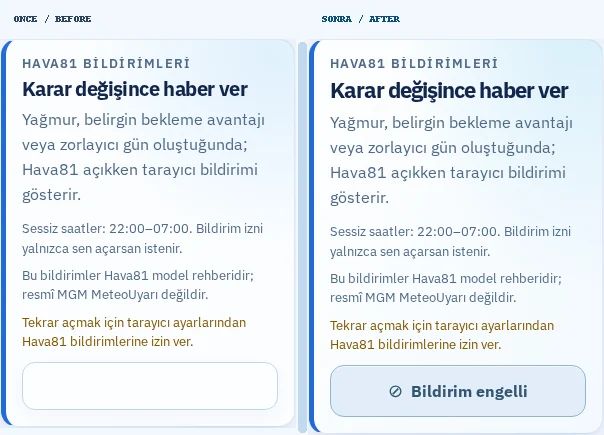

# Hava81 — Bildirim Düğmesi: Önce / Sonra

**Tarih:** 9 Ekim 2026
**Kaynak:** `main`, `bd819e9` (PR #1293 sonrası)
**Geliştirme dalı:** `fix/notification-cta-readability-20261009`

## Tespit: Canlı ekrandaki boş düğme

Gerçek Chromium ile `https://hava81.zekiakgul.dev/izmir/` açıldığında Hava81 Bildirimleri bölümündeki düğme **beyaz zemin üstünde beyaz yazı** gösteriyordu. Bu nedenle `Bildirim engelli` metni görünmüyordu. Bunun nedeni, tarayıcı bildirim izni `denied` olduğunda pasif durumun global stil kurallarından beyaz yazı devralmasıydı. React tarafında doğru metin ve `disabled` semantiği zaten bulunuyordu.

## Madde madde yapılan değişiklikler

1. **Görünmeyen metin:** Beyaz/beyaz yazı–zemin ikilisi → koyu mavi yazılı, açık mavi arka planlı, kontrastlı durum kontrolü.
2. **Görsel durum ayrımı:** İzin engellendiğinde pasif düğme artık aktif düğmeyle aynı görünmüyor; küçük `⊘` simgesi ve belirgin çerçevesi var. Hâlâ gerçek anlamda devre dışı.
3. **Aktif bildirim eylemi:** İzin istenebiliyorsa okunabilir beyaz yazılı mavi gradyan düğme; zaten açıksa turkuaz aktif görünüm.
4. **Koyu tema:** Pasif durumda koyu petrol yüzey ve açık yazı için ayrı, erişilebilir kontrast kuralı.
5. **Kart yüzeyi:** Hava81'in lacivert–turkuaz tasarım diliyle uyumlu, kontrollü hafif mavi renk geçişi ve daha net başlık.
6. **Mobil/tabela:** 390 px, 320 px ve %200 metin büyütmede uzun bildirim metni taşmadan sığıyor.
7. **Erişilebilirlik:** Pasif düğme `disabled` ve izin yardımıyla bağlantılı `aria-describedby` semantiğini koruyor. Zorlanmış renkler ve hareket azaltma seçenekleri için stil eklendi.
8. **Çalışma mantığı:** Bildirim izinleri, API çağrıları, servis çalışanı, zaman aralığı veya uyarı algoritması **değiştirilmedi**.

## Gerçek Playwright karşılaştırmaları

Sol: **ÖNCE (canlı site)**. Sağ: **SONRA (ayrı production preview)**. Her görüntü aynı Bildirimler bileşeninden alınmıştır; metin değiştirilmemiştir.

| Ekran / tema | Önce ve sonra |
|---|---|
| Masaüstü 1440 px, açık |  |
| Masaüstü 1440 px, koyu |  |
| Mobil 390 px, açık |  |
| Mobil 390 px, koyu |  |
| Küçük telefon 320 px, açık |  |

## Doğrulama

- **Yazı kontrastı:** Açık 6,66:1, koyu 7,80:1 (WCAG normal metin için 4,5:1 eşiğinin üzerinde).
- **Gerçek tarayıcı görsel taraması:** Güncel canlı `main` ile yeni preview arasında 5 önce ve 5 sonra, toplam 10/10 kontrol; yatay taşma veya JavaScript hatası yok.
- **TypeScript, ESLint, production build:** Başarılı.
- **Vitest:** 763/763 birim testi başarılı.
- **Playwright:** 5 hedeflenen test başarılı, 3 cihaz-kısıtlı test atlandı. Pasif/aktif bildirim durumu, mobil/masaüstü ve %200 metin büyütme regresyonları doğrulandı.
- **Önceki düzen:** Masaüstü bildirim kartı ve mobil erişilebilirlik testleri korunuyor.
- **CI/CD:** GitHub PR kontrolleri yeşil olmadan birleştirme/dağıtım yapılmayacak.

Ham PNG dosyaları, ölçüm JSON'u ve tekrar üretme aracı `test-results/notification-cta-20261009/` ve `scripts/capture-notification-cta.mjs` altında sunucudadır. Karşılaştırmalar GitHub'da bu dosya ile birlikte saklanır.

**Korunan çalışma:** `/home/ubuntu/Hava81-latest` içindeki commit edilmemiş üç dosyaya müdahale edilmedi.
