# Hava81 — Planlama panelleri / Görsel yenileme (9 Ekim 2026)

**Dal:** `feat/planning-visual-hierarchy-20261009`
**Taban:** `main` commit `7851d23` (PR #1285 sonrası).
**Kapsam:** Gün Planı, Çıkış Planı, Aktivite Planlayıcı, bağlam sinyalleri. Kullanıcının talebi doğrultusunda *gözle görülür tasarım* önceliklidir.

## Madde madde: Öncesi → Sonrası

1. **Gün planı üst kısmı:** Bembeyaz başlık/serbest skor → lacivert–turkuaz gökyüzü bandı, büyük beyaz başlık ve ayrılmış cam efektli skor kartı.
2. **Gün planı kararı:** Solda çizgili bilgi kutusu → daha belirgin, dolgulu ve yuvarlatılmış karar kartı.
3. **Günlük durum üçlüsü:** Satır ayraçları → boşluklu, hafif gölgeli üç bento kartı (Şemsiye, Rüzgâr, Hava Kalitesi).
4. **Saatlik uygunluk:** Ayraçlı, iç içe duran saat listesi → her saati ayrı okunur kart hâline getiren ve yatay gezinmesi korunan şerit.
5. **Açıklama:** Düz ayraç → açılır/kapanır, çerçeveli ve klavyeyle kullanılabilen bilgi alanı.
6. **Çıkış Planı:** Düz form satırı → kendi içinde gruplanmış iki saat seçimi; tavsiye bandı ve ayrı pencere kartları.
7. **Aktiviteler:** Metin ağırlıklı öneri listesi → dolu mavi seçili etkinlik rozetleri ve farklı uyarı düzeylerine sahip belirgin kartlar.
8. **Bağlam göstergeleri:** Düz 4 sütun istatistik → ayrı çerçeveli, yuvarlatılmış ölçüm kartları.
9. **Responsive:** Tablet, mobil (390px), küçük mobil (320px) ve koyu temada bağımsız yerleşim iyileştirmeleri.
10. **Veri ve işlev:** Tahmin API'si, puan hesaplamaları, aktivite seçimi, zaman alanları, veri doğruluğu ve erişilebilirlik davranışı değiştirilmedi. Mevcut Playwright stil sözleşmesi yeni bento görünüme güncellendi.

## Playwright tarafından kaydedilmiş karşılaştırmalar

Her görselin solu **ÖNCE** (canlı site, eski stil), sağı **SONRA** (sunucudaki yeni production build) hâlidir. Aynı İzmir sayfası kullanıldı. Hava durumu zaman içinde değişebileceği için karşılaştırmanın amacı yapı, aralık, tipografi ve stil farklılıklarıdır.

| Ekran | Gün planı | Çıkış planı | Aktivite planı |
|---|---|---|---|
| Masaüstü / Açık | 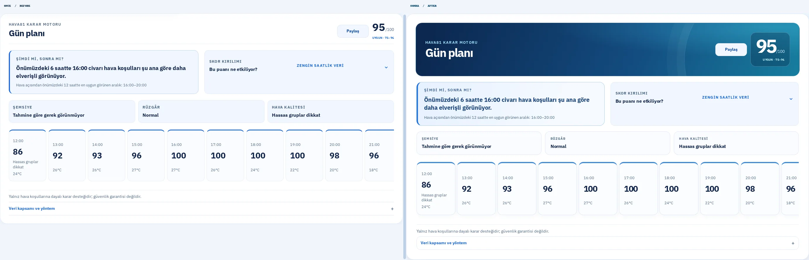 | 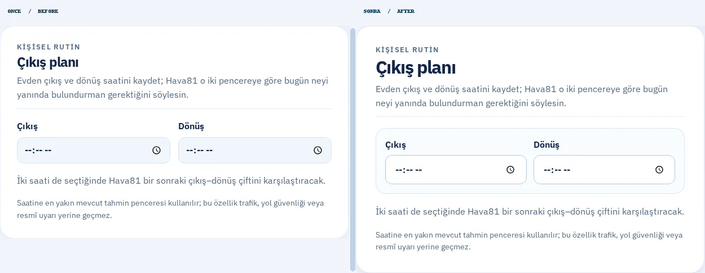 | 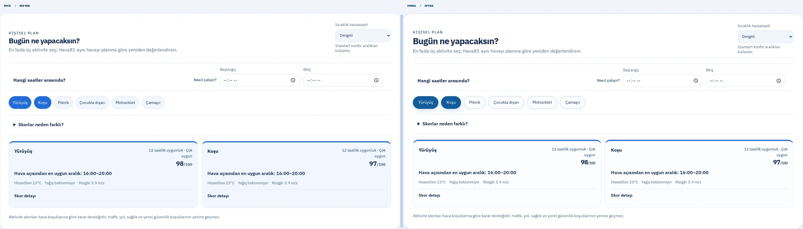 |
| Tablet / Açık | 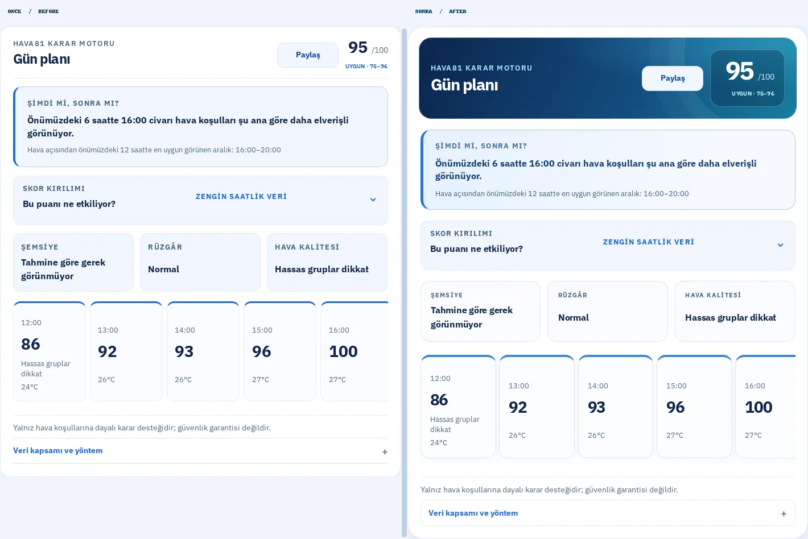 | 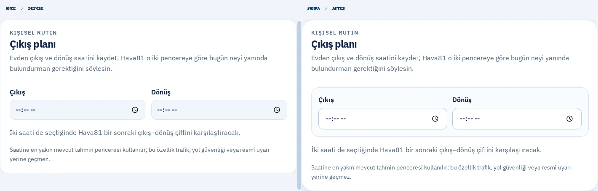 | 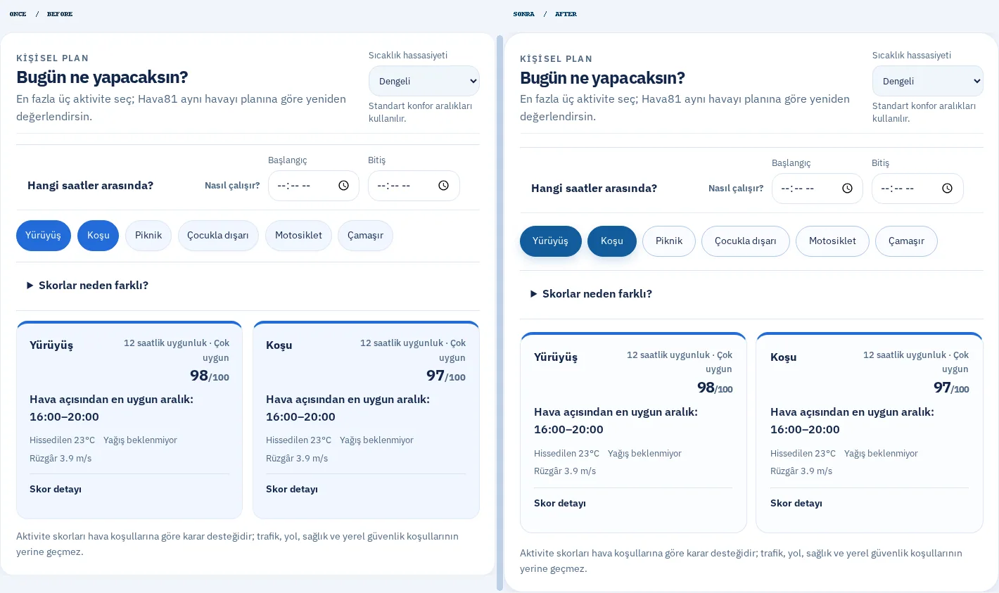 |
| Mobil / Açık | 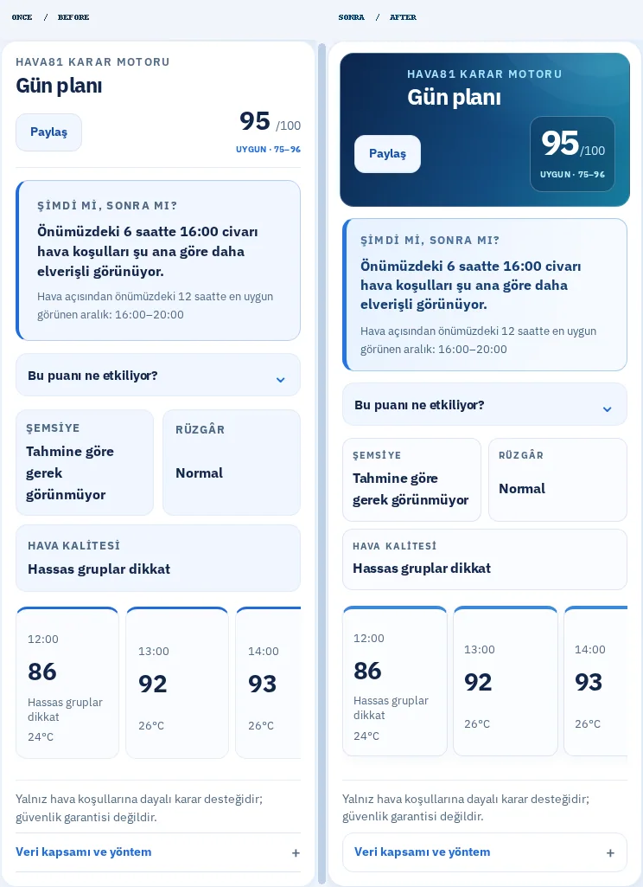 | 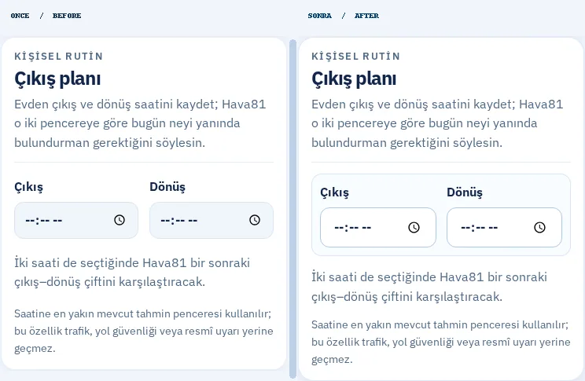 | 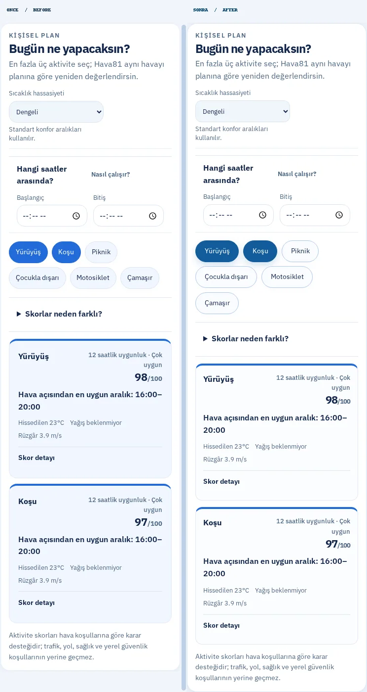 |
| Mobil / Koyu | 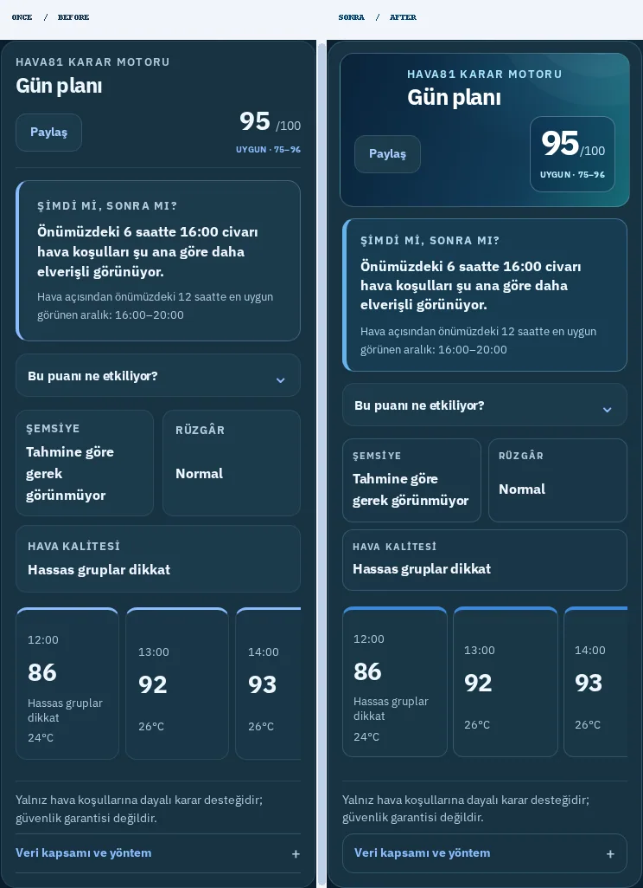 | 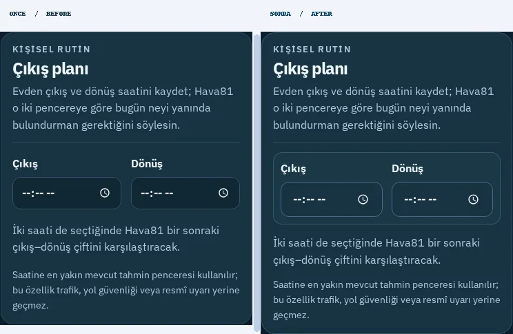 | 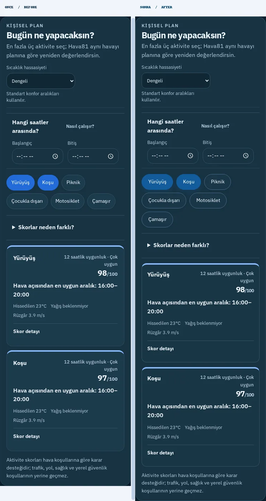 |
| 320px / Açık | 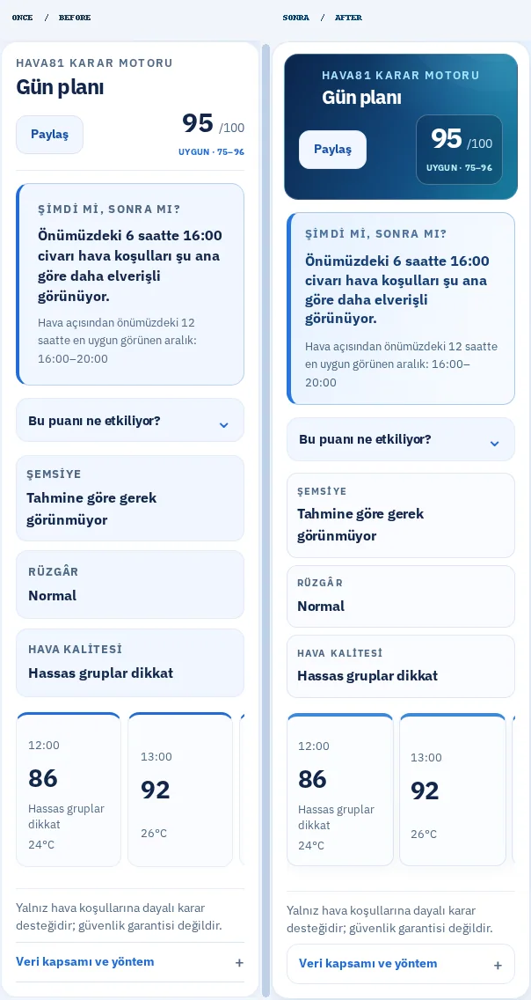 | 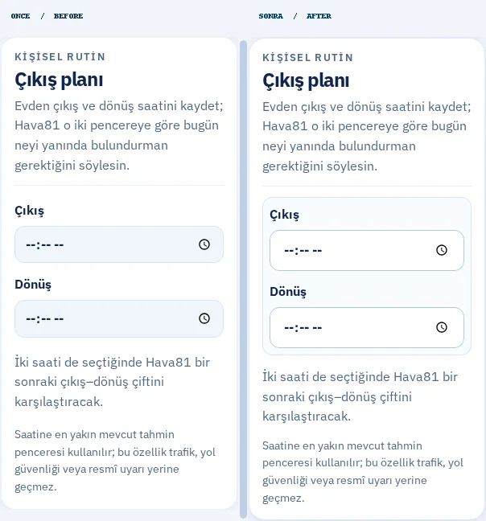 | 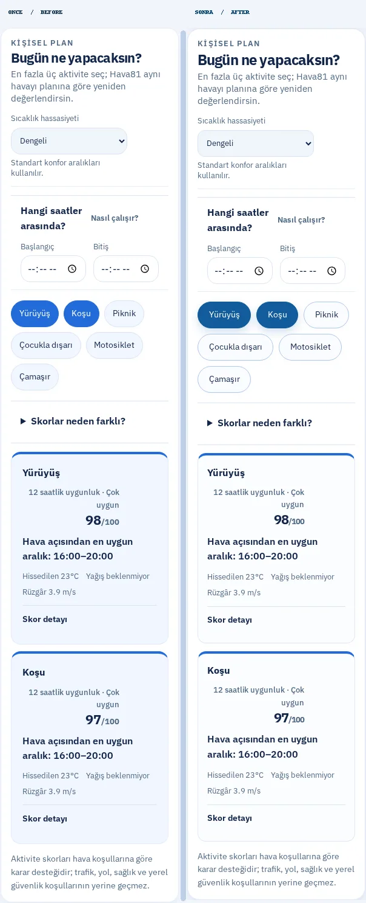 |

Ham, kırpılmamış PNG'ler ve ölçüm çıktısı `/home/ubuntu/Hava81-planning-visual-20261009/test-results/planning-visual/screens/` dizininde; `scripts/capture-planning-visual.mjs` ile yeniden üretilebilir. Bu script yalnızca *kanıt ekran görüntüsü* için sabit başlığı gizler; uygulamanın CSS'ini değiştirmez.

## Kalite kapıları

- TypeScript: **Başarılı**
- ESLint: **Başarılı**
- Production Vite build: **Başarılı**
- Vitest: **763 / 763**, 108 dosya başarılı
- Playwright görsel taraması: **10 / 10** (önce+sonra), JS hatası veya yatay taşma yok
- Hedefli tarayıcı akışları: sonuç GitHub PR oluşturulmadan önce yeniden doğrulanacak.
- GitHub CI/CD ve CodeQL: **PR açıldıktan sonra bekle / kontrol et**
- Squash merge ve canlı dağıtım: **tüm kontroller başarılı olmadan yapılmaz**

## Güvenlik

Tüm çalışma ayrı worktree içinde; `/home/ubuntu/Hava81-latest` dizinindeki commit edilmemiş üç dosya korunmuştur.
