# Hava81 — Rota Havası ve Hava Uyarıları / Önce → Sonra

**Tarih:** 9 Ekim 2026
**Dal:** `feat/route-alert-premium-20261009`
**Taban:** `main`, squash commit `977d208` (Gün Planı PR #1286 sonrası)

## Kullanıcının istediği, gözle görülür iyileştirmeler

1. **Rota sayfası başlığı:** Sade beyaz, düz akordeon başlığı yerine **lacivert–turkuaz gökyüzü şeridi**, güçlü rota başlığı ve okunur açıklama.
2. **Rota kapat/aç kontrolü:** İnce küçük ok yerine kontrastlı, yuvarlatılmış 45 px kontrol; klavye odağı ve `details/summary` davranışı korundu.
3. **Şehirler arası form:** Düz yan yana alanlardan, kenarlıklı ve dolgulu bütünleşik bir **rota kontrol paneline** geçildi.
4. **Yön değiştirme:** Masaüstünde dar alana sıkışmış düğme genişletilip tek satır okunur hâle getirildi; mobilde dairesel, 44 × 44 px dokunmatik alan.
5. **320 px küçük ekran:** Başlangıç / Varış seçimleri en az 180 px genişlikte; ekran dışına taşma yok. `Başlangıç ↔ Varış` gerçek etkileşimi aynı kaldı.
6. **Kalkış saati:** Daha büyük ve tutarlı tarih-saat alanı; Türkçe / Türkiye saat dilimi davranışı değiştirilmedi.
7. **Koridor sonucu:** Rota puanı ayrı dolu sonuç kartına, beş yol kesiti ise durum renkleri bulunan **bağımsız yuvarlatılmış kartlara** dönüştürüldü. Mobilde yatay kaydırma korunuyor.
8. **Uyarı panosu:** Kenardan kenara uzanan düz satır yerine sol vurgu kenarlı, yumuşak geçişli, çerçeveli, gölgeli fayda kartı.
9. **Uyarı eylemi:** Gerçek bildirim izin mantığı korunarak daha belirgin kenarlık, buton ölçüsü ve basılı/seçili durum.
10. **Responsive + tema + erişilebilirlik:** 1440/768/390 açık-koyu/320 px görüntüler, %200 metin, keyboard focus ve forced-colors varyantları gözetildi.

Yalnızca CSS görünümü, CSS importları, görsel kanıt scriptleri ve mevcut **görsel sözleşme** Playwright testlerinin beklenen stilleri güncellendi. Hava durumu, rota puanlaması, bildirimlerin saklanması, API çağrıları veya gerçek iş kuralları değiştirilmedi.

## Playwright görsel kanıtları

Aşağıdaki her görselde **ÖNCE solda**, **SONRA sağda**. Önce: gerçek üretim sitesi `hava81.zekiakgul.dev/istanbul`. Sonra: sunucudaki yeni production build preview. Farklı dakikalarda alınan hava/rota değerleri değişebilir; stil farkı değerlendirilir.

| Ekran | Rota Havası | Hava Uyarıları |
|---|---|---|
| Masaüstü · Açık (1440 px) | 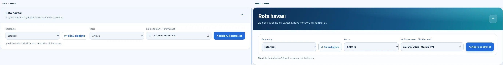 | 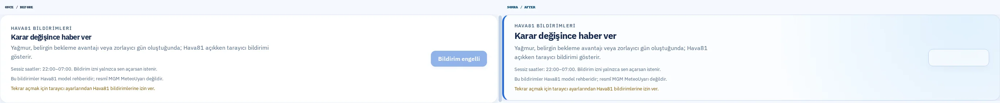 |
| Tablet · Açık (768 px) | 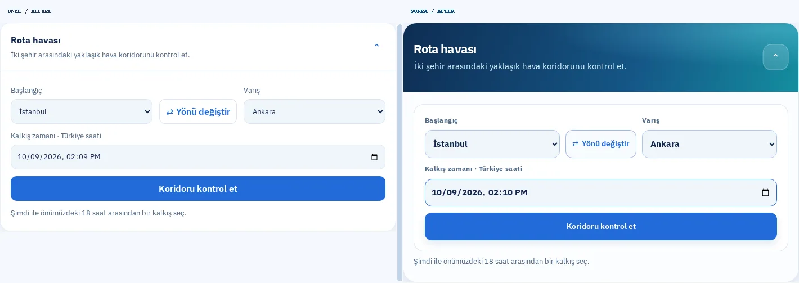 | 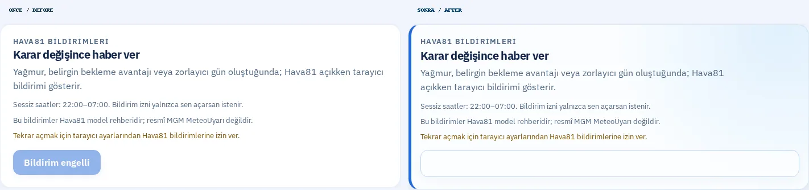 |
| Mobil · Açık (390 px) | 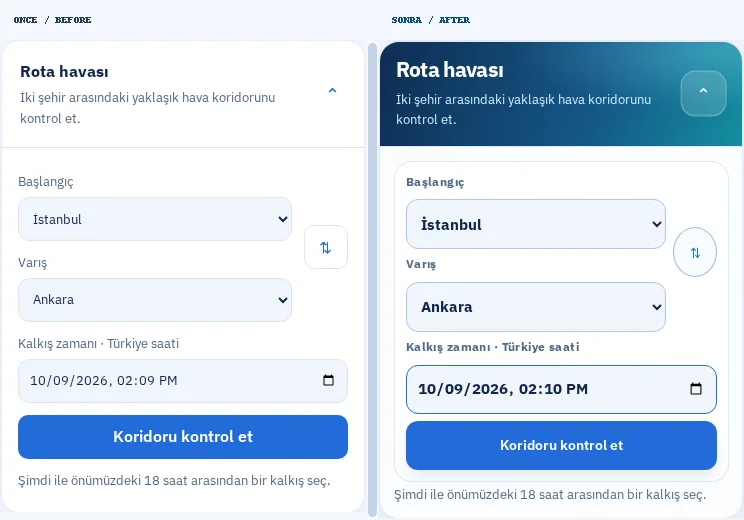 | 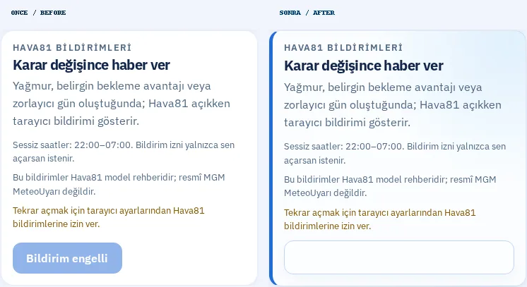 |
| Mobil · Koyu (390 px) | 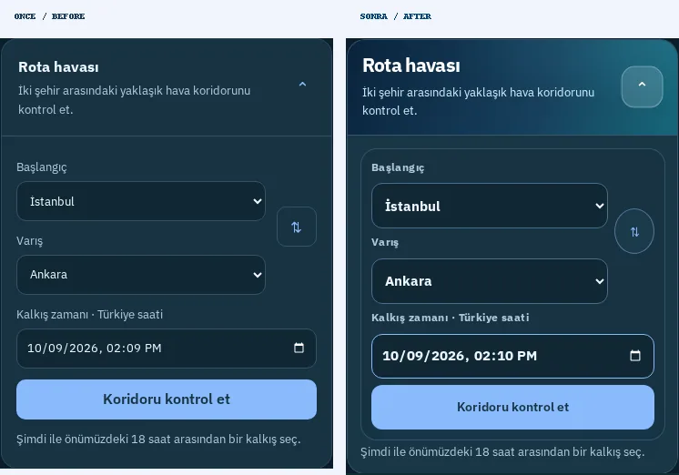 | 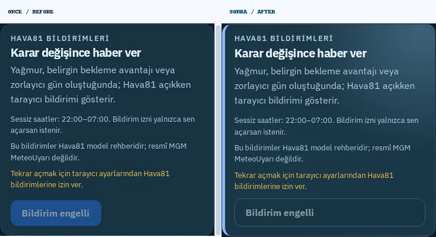 |
| Küçük mobil · Açık (320 px) | 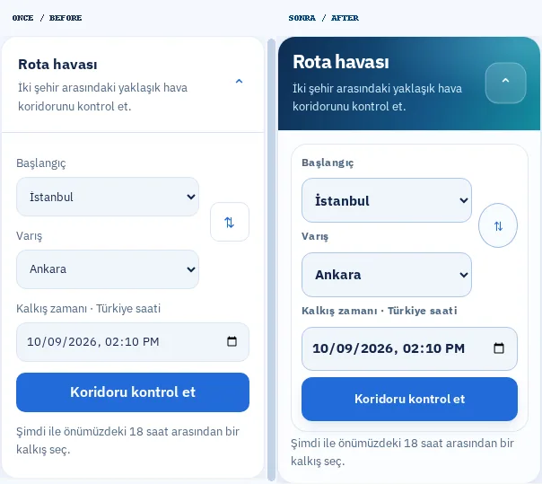 | 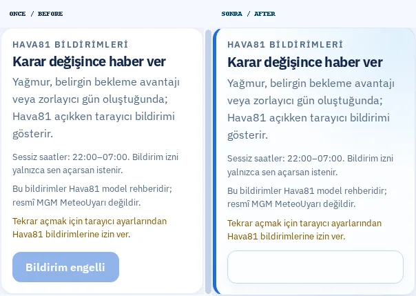 |

### Rota sorgusundan sonraki sonuçlar

Bu iki ek karşılaştırma; İstanbul → Ankara koridoru sorgulandıktan sonra
görünen toplam puan ve beş yol-kesiti kartını içerir. Rota tahmini, güvenlik
uyarısı ve kaynak API aynı kalır.

| Sonuç ekranı | Önce / Sonra |
|---|---|
| Masaüstü (1440 px) | 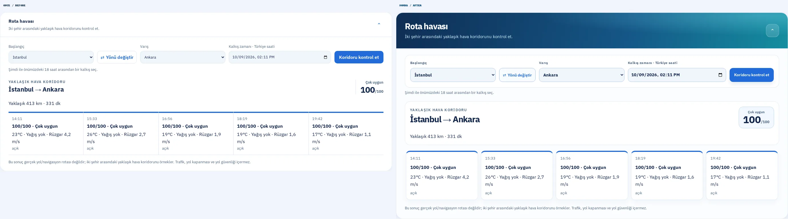 |
| Mobil (390 px) | 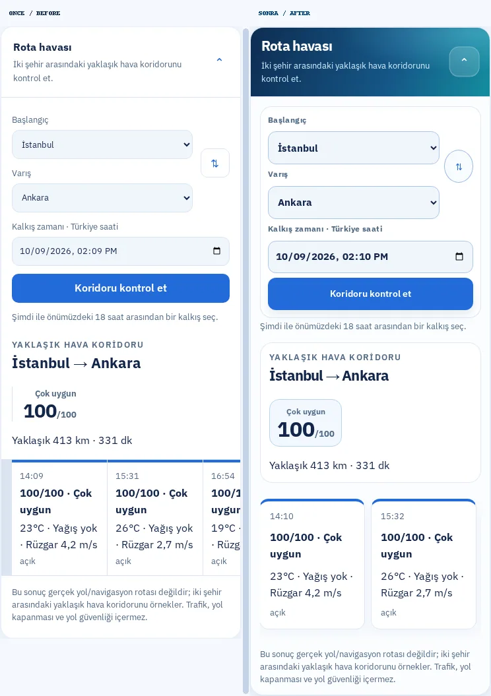 |

**Ham ekran görüntüleri ve JSON ölçümleri:** `/home/ubuntu/Hava81-route-alert-final-20261009/test-results/route-alert/screens/`.
**Görsel üretimi:** `node scripts/capture-route-alert-visual.mjs`; isteğe göre `HAVA81_BEFORE_URL`, `HAVA81_AFTER_URL`, `HAVA81_VISUAL_DIR`.

## Yerel doğrulama

- TypeScript: başarılı
- ESLint: başarılı
- Production build: başarılı
- Görsel Playwright: **10/10**, yatay taşma ve JavaScript pageerror yok; sorgu sonrası **4/4** rota sonucu kaydedildi
- Önemli Playwright akışları: **7/7 başarılı**, diğer varyantlar hedef proje açısından atlandı (normal)
- Birim testleri: **763 / 763, 108 dosya başarılı**
- GitHub CI/CD + CodeQL: PR açıldıktan sonra doğrulanır

**Güvenlik:** `/home/ubuntu/Hava81-latest` dizinindeki üç commit edilmemiş dosya korunmuştur. Tüm değişiklikler bağımsız worktree üzerinden işlenmiştir. CI/CD ve CodeQL yeşil olmadan merge yapılmaz.
