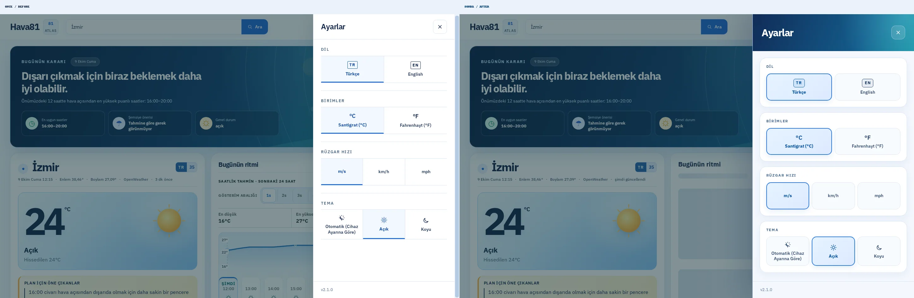
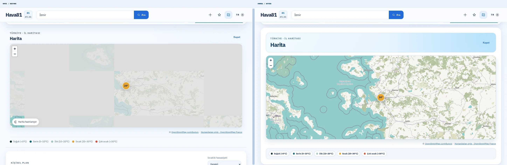
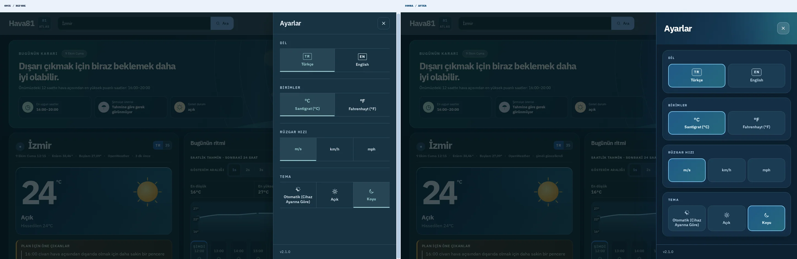
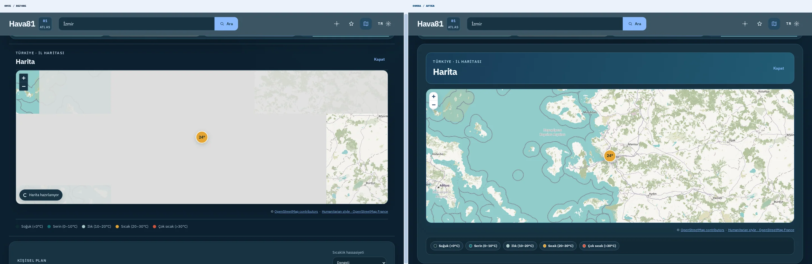
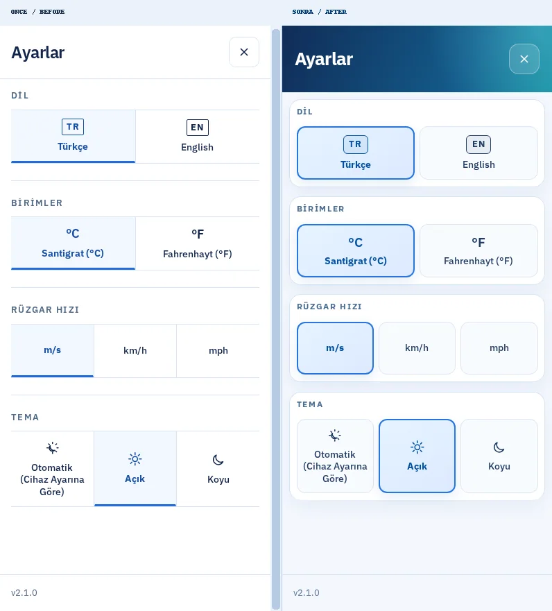
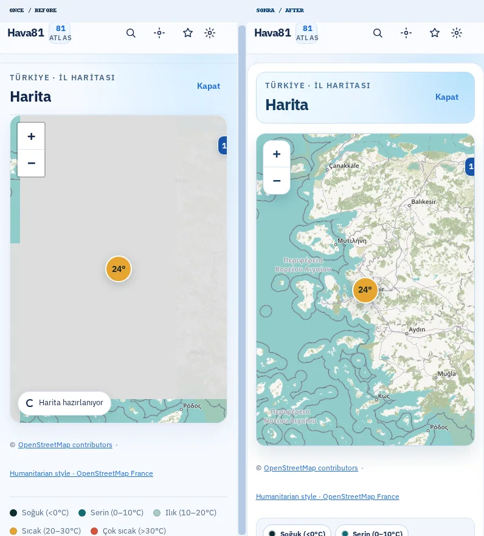
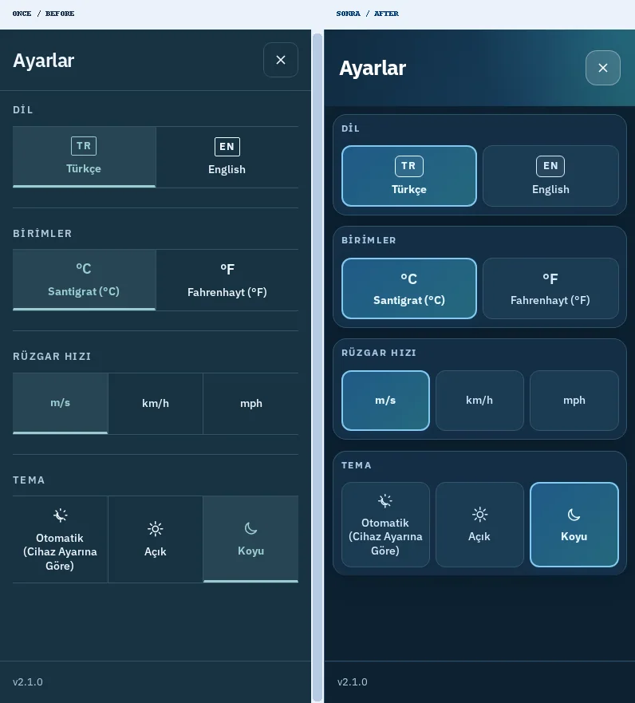
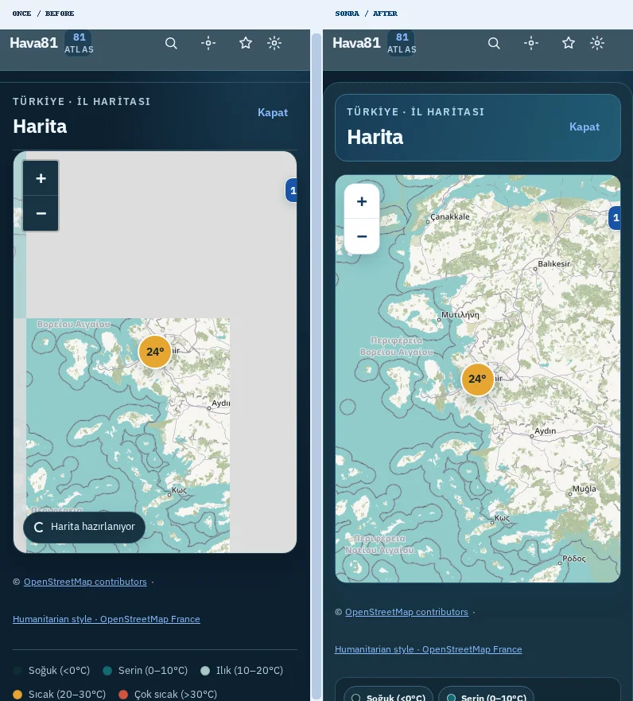
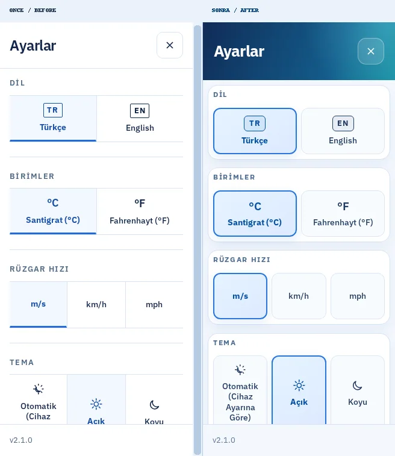
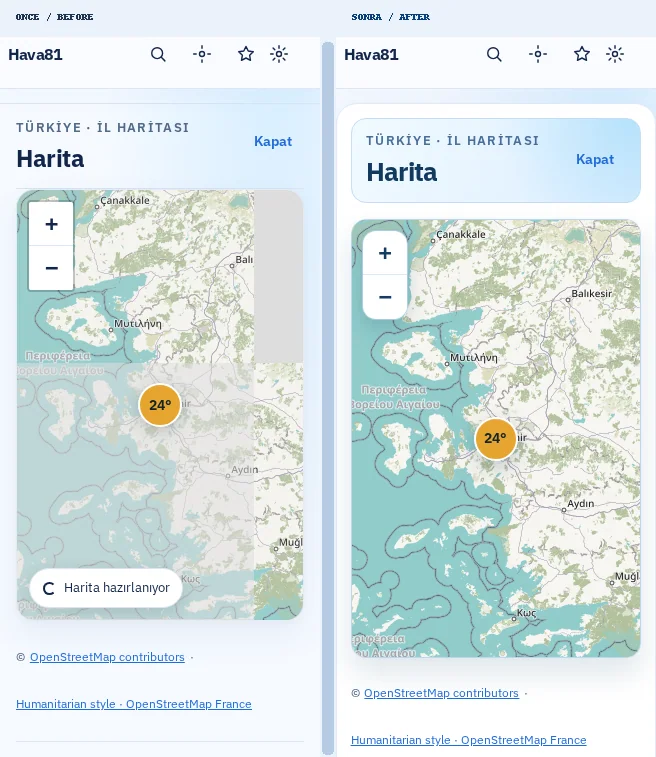

# Hava81 — Ayarlar ve Harita: Önce / Sonra

**Tarih:** 9 Ekim 2026
**Dal:** `feat/secondary-surface-visual-polish-20261009`
**Taban:** `main` / `56611c0` (PR #1283 birleştirmesinden sonra).

## Gözle görülür yenilikler

1. **Ayarlar başlığı:** Beyaz düz başlık → lacivert–turkuaz gökyüzü geçişli, daha güçlü tipografili panel.
2. **Ayar grupları:** İnce çizgilerle ayrılmış satırlar → dört ayrı yuvarlak köşeli kart (Dil, Birimler, Rüzgâr Hızı, Tema).
3. **Aktif seçim:** Sadece altı çizili düğme → arka planı, sınırı ve gölgesi belirgin seçim kartı.
4. **Koyu tema:** Açık tema CSS'sine bağlı yüzey → özel koyu mavi kartlar ve turkuaz vurgular.
5. **Harita başlığı:** Düz başlık → gökyüzü renkli, görsel hiyerarşisi güçlü başlık kartı.
6. **Harita yüzeyi:** Köşeli çerçeve → gölgeli ve yuvarlatılmış harita, uyumlu yakınlaştırma kontrolleri.
7. **Sıcaklık lejantı:** Serbest metin ve renk noktaları → gruplandırılmış hap şeklinde bilgi kartları.
8. **Responsive:** Mobil 390/320px, tablet ve masaüstünde hizalamalar düzenlendi.
9. **Erişilebilirlik:** 200% metin büyütmede ayar seçeneklerinin yeniden akışı ve dar yatay ekranda sabit footer korundu.
10. **Fonksiyonel kapsam:** API, harita sağlayıcısı, şehir verileri, ayarların saklanması ve klavye odak yönetimi değiştirilmedi. Var olan *yalnızca görsel* E2E beklentileri yeni tasarım değerlerine güncellendi.

## Playwright karşılaştırma panosu

Her hücre *gerçek Chromium* ile çekilmiş **ÖNCE (sol) | SONRA (sağ)** görünümüdür. Önce canlı üretim sitesi, sonra Vite production preview. Hava sıcaklığı ve zaman damgaları, farklı istek zamanları nedeniyle değişebilir; CSS farklarına odaklanın.

| Ekran | Ayarlar | Harita |
|---|---|---|
| Masaüstü · açık |  |  |
| Masaüstü · koyu |  |  |
| Mobil 390px · açık |  |  |
| Mobil 390px · koyu |  |  |
| Küçük mobil 320px · açık |  |  |

**Ham PNG ve ölçüm JSON dosyaları:** sunucuda `/home/ubuntu/Hava81-secondary-surfaces-20261009/test-results/secondary-visual/screens/`. Görüntüler GitHub için boyutları korunarak WebP'ye dönüştürüldü. On adet karşılaştırma panosu toplam yaklaşık 800 KB.

**Tekrar çekim:** `node scripts/capture-secondary-surfaces.mjs`. Ortam değişkenleri: `HAVA81_BEFORE_URL`, `HAVA81_AFTER_URL`, `HAVA81_VISUAL_DIR`, `HAVA81_VISUAL_PHASE`.

## Kalite sonuçları (PR gönderilmeden önce)

| Kontrol | Sonuç |
|---|---|
| TypeScript | ✅ Geçti |
| ESLint | ✅ Geçti |
| Production build | ✅ Geçti |
| Vitest | ✅ **763 / 763**, 108 dosya |
| Hedef Playwright testleri | ✅ **7 / 7**, diğer 7 varyant bilinçli olarak atlandı |
| Ekran/tema taraması | ✅ **10 / 10** (önce + sonra), yeniden çekilen yeni sürüm **5 / 5** |
| Yatay taşma / JS pageerror | ✅ Saptanmadı |
| %200 metin büyütme | ✅ Dar mobil + yatay ekran testleri geçti |

**Yayın kuralı:** GitHub CI/CD ve CodeQL başarılı olmadan squash merge ve canlı dağıtım yapılmayacak. Ana çalışma dizini `/home/ubuntu/Hava81-latest` içindeki üç commit edilmemiş dosya değiştirilmedi.
