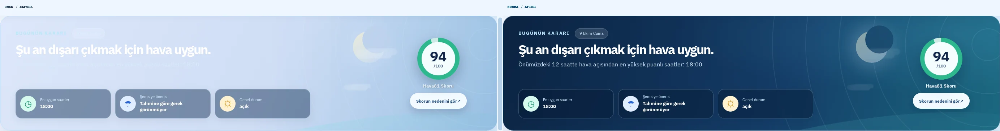
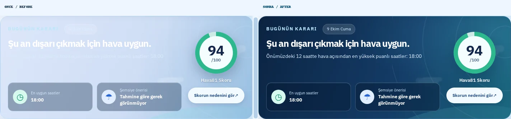
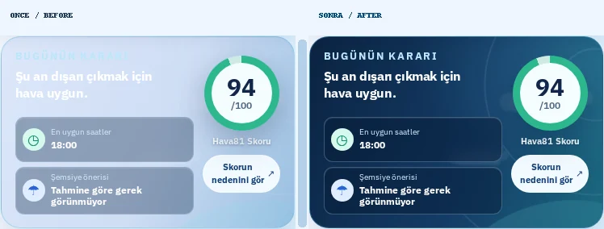
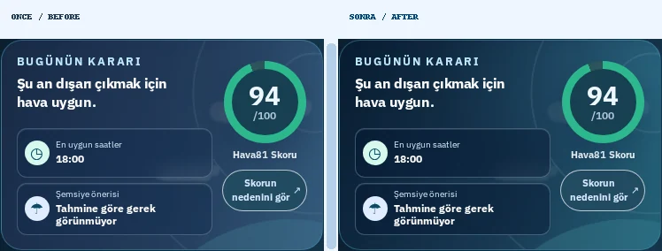
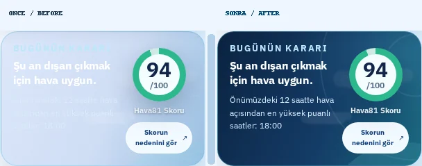

# Hava81 — Hava durumuna göre değişen karar kartında kontrast düzeltmesi

**Tarih:** 9 Ekim 2026 · **Başlangıç commit'i:** `a996842` · **Dal:** `fix/verified-weather-scene-contrast-20261009`.

## Canlı sürümde tespit edilen sorun

Playwright ile alınan gerçek ekran görüntülerinde İzmir için gece saatlerinde "Bugünün kararı" kartının beyaz başlığı açık mavi–lila zemin üzerinde çok zor okunuyordu. Aynı kusur hem 1440px masaüstünde hem 390px mobilde görüldü. Teknik neden: önceki `WeatherPolish.css` dosyasındaki `[data-night='true']`, `[data-weather-scene='cloud' | 'rain' | 'snow' | 'mist']` kuralları, daha sonra uygulanan koyu premium hero gradyanını CSS özgüllüğü nedeniyle geçersiz kılıyordu.

## Görünür değişiklikler — Önce → Sonra

1. **Gece görünümü:** Açık lila zemin → lacivert–petrol gradyanı; beyaz ana başlık ve alt açıklama netleşti.
2. **Bulutlu hava:** Açık mavi zemin → derin çelik mavi gradyan. Bulut süslemeleri korunuyor.
3. **Yağmur / kar:** Açık renkli arka planlar → birbirinden ayırt edilebilen koyu, hava durumuyla uyumlu yüzeyler; yağış süslemeleri korunuyor.
4. **Sis:** Çok açık gri zemin → koyu gri-mavi yüzey; sis atmosferi korunuyor.
5. **Gece + yağış:** Gece paleti, diğer hava durumu dekorlarının altında kalmıyor.
6. **Hızlı karar özetleri:** Gece kartlarının zemin tonları koyulaştırıldı; beyaz metinle kontrast güçlendirildi.
7. **Mobil 320/390px:** Score halkasının taşmaması ve butonların kullanılabilirliği korundu.
8. **%200 metin büyütme:** Görsel dekorların opaklığı kısılıyor; büyük metinler ve skor okunur kalıyor.
9. **Koyu tema / forced colors:** Ayrı koyu mod tonları korundu; yüksek kontrast modunda sistem renkleri kullanılıyor.
10. **İşlev:** Karar puanı, tahmin verisi, API ve arama/harita/aktivite akışları değiştirilmedi; düzeltme CSS katmanında.

## Gerçek Playwright — 5 önce/sonra karşılaştırması

Görseller gerçek Chromium ile alınmıştır. Her dosyada **sol: eski canlı sürüm; sağ: yeni production preview**. İki görüntüde de İzmir için gerçek hava API verisi kullanılmış ve karar puanının görünmesi beklenmiştir. Testler ayrıca gece, bulut, yağmur, kar ve sis CSS durumlarını deterministik fixture ile ayrı ayrı denetler.

| Ekran | Karşılaştırma |
|---|---|
| 1440px masaüstü — açık tema |  |
| 768px tablet — açık tema |  |
| 390px mobil — açık tema |  |
| 390px mobil — koyu tema |  |
| 320px küçük telefon — açık tema |  |

Ham PNG ve JSON ölçümler: `/home/ubuntu/Hava81-scene-contrast-verified-20261009/test-results/scene-contrast/screens/`. Yeniden yakalamak için `node scripts/capture-scene-contrast.mjs` (yerel production preview ayarları script içerisinde).

## Doğrulama

- **TypeScript:** Başarılı
- **ESLint:** Başarılı
- **Production Vite build:** Başarılı
- **Vitest:** 763/763 başarılı
- **Hedeflenen Playwright:** 6 başarılı, 4 cihaz-özel atlandı
- **Önce/sonra Playwright ekran taraması:** 10/10 başarılı (5 önce + 5 sonra), yatay taşma ve JavaScript pageerror yok
- **Ek kontrast güvencesi:** Senaryo başlangıç gradyanları ile beyaz metin arasında en az 7:1 kontrast eşiği test edilir.
- **Git diff --check:** Başarılı

**Güvenlik:** Kullanıcının `/home/ubuntu/Hava81-latest` dizinindeki üç commit edilmemiş dosyaya dokunulmadı. Ayrı Git worktree kullanıldı. GitHub CI/CD ve CodeQL tamamlanmadan PR birleştirilmeyecek.
